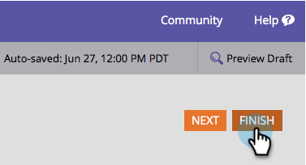

# {#delete-a-field-in-a-form} 형식의 필드 삭제

양식에 더 이상 필요하지 않은 필드가 있으면 쉽게 삭제할 수 있습니다. 방법

1. **마케팅 활동**&#x200B;으로 이동합니다.

   

1. 양식을 선택하고 **양식 편집**&#x200B;을 클릭합니다.

   

1. 필드를 선택하고 **delete** 아이콘을 클릭합니다.

   

1. **완료**&#x200B;를 클릭합니다.

   

1. **승인 및 닫기**&#x200B;를 클릭합니다.

   

>[!NOTE]
>
>양식 변경으로 만든 [랜딩 페이지 초안 승인](/help/marketo/product-docs/demand-generation/landing-pages/understanding-landing-pages/approve-unapprove-or-delete-a-landing-page.md)을 잊지 마십시오.
