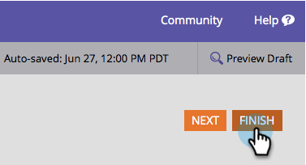

# 양식의 필드 삭제 {#delete-a-field-in-a-form}

양식에 더 이상 필요하지 않은 필드가 있으면 쉽게 삭제할 수 있습니다. 방법은 다음과 같습니다.

1. **[!UICONTROL Marketing Activities]** 으로 이동합니다.

   

1. 양식을 선택하고 **[!UICONTROL Edit Form]**&#x200B;을(를) 클릭합니다.

   

1. 필드를 선택하고 **[!UICONTROL Delete]** 아이콘을 클릭합니다.

   

1. **[!UICONTROL Finish]**&#x200B;를 클릭합니다.

   

1. **[!UICONTROL Approve and Close]**&#x200B;를 클릭합니다.

   

>[!NOTE]
>
>양식을 변경하여 만든 [랜딩 페이지 초안 승인](/help/marketo/product-docs/demand-generation/landing-pages/understanding-landing-pages/approve-unapprove-or-delete-a-landing-page.md)을 잊지 마십시오.
