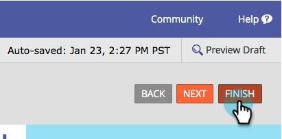

# 양식 필드에 대한 사전 채우기 비활성화 {#disable-pre-fill-for-a-form-field}

웹 방문자가 알고 있는 경우(쿠키) Marketing Forms에서는 기본적으로 필드에 정보를 미리 채웁니다. 이 기능을 끄려면 이 방법을 사용합니다.

>[!NOTE]
>
>**기본적으로 양식 채우기** 기능이 활성화되어 있습니다. 랜딩 페이지 수준 사전 채우기 설정 및 관리 수준 사전 채우기 설정이 양식 수준 설정에 비해 우선합니다.
>
>양식 &lt; 랜딩 페이지 &lt; 관리

1. 마케팅 **활동** 으로 **이동합니다**.

   

1. 양식을 선택하고 양식 **편집을** **클릭합니다**.

   

   >[!CAUTION]
   >
   >양식 사전 채우기는 양식을 자신의 페이지에 포함할 때 작동하지 않습니다. Marketing To 랜딩 페이지에서만 작동합니다.

1. 필드 중 하나를 선택하고 **양식******&#x200B;사전&#x200B;**** 채우기 ****&#x200B;를사용 안 함으로설정합니다.

   

   >[!TIP]
   >
   >랜딩 페이지 수준 또는 관리 수준에서 양식 사전 채우기를 비활성화할 수도 있습니다.

1. 마침을 **클릭합니다**.

   

1. 승인 **및 닫기를 클릭합니다**.

   

잘했어!

>[!NOTE]
>
>**딥 다이브**
>
>양식에 대한 자세한 내용을 [알고 싶으십니까](http://docs.marketo.com/display/docs/forms)?

