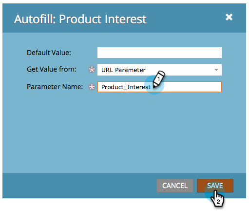

# 숨겨진 양식 필드 값 설정 {#set-a-hidden-form-field-value}

숨겨진 필드는 일반적으로 동적으로 채워집니다. 양식을 채우는 사람에게는 표시되지 않습니다. 값을 설정하는 방법은 다음과 같습니다.

>[!PREREQUISITES]
>
>[양식 필드를 숨김으로 설정](set-a-form-field-as-hidden.md)

## 필드 선택 {#select-the-field}

1. 양식에서 숨김 필드를 선택하고 자동 채우기 **에** 대해 **편집을 클릭합니다**.

   

## 기본값 사용 {#use-default-value}

기본값 사용을 선택하면 이 양식이 전송될 때 항상 사용할 특정 값을 하드 코딩할 수 있습니다. 기본값을 입력하고 저장을 클릭합니다.

## URL 매개 변수 {#url-parameter}

양식을 작성할 때 사용하는 페이지에서 URL 매개 변수(쿼리 문자열)를 캡처하려면 **URL** 매개 **변수를 사용하여 숨김 필드를** 채울 수 있습니다.

>[!NOTE]
>
>매개 변수는 좀 기술적이죠? 하지만 한번 얻으면 그들은 강력합니다. 쿼리 문자열에서 이 [위키피디아 페이지는](http://en.wikipedia.org/wiki/Query_string) 다소 도움이 됩니다.

1. 값 **유형** 가져오기를 **위한 URL 매개 변수를 선택합니다**.

   

1. 매개 변수 이름 **을** 입력하고 **저장을 클릭합니다**.

   

>[!TIP]
>
>URL 매개 변수를 찾을 수 없는 경우 기본값을 입력할 수 있습니다.

## 쿠키 값 {#cookie-value}

쿠키를 통해 데이터를 저장하는 경우, **쿠키** 값 **을** 사용하여 양식이 제출되면 데이터를 수집할 수 있습니다.

1. Get **Value** Value **For** Get **** Value **** ****&#x200B;에서 값을 선택합니다.

   

1. 원하는 쿠키 매개 변수 이름을 입력하고 **저장을 클릭합니다**.

   

   >[!TIP]
   >
   >매개 변수/쿠키를 찾을 수 없는 경우 기본값을 입력할 수 있습니다.

## 레퍼러 매개 변수 {#referrer-parameter}

양식을 작성하기 전에 방문자가 가져온 페이지에서 데이터를 캡처하려면 레퍼러 **매개 변수** 를 사용할 수 **있습니다**.

1. Get **Value****를** ReferrerCownerr매개 변수 **** **** ****&#x200B;로 설정합니다.

   

1. 레퍼러 URL에서 **캐치할** 매개 변수 이름을 입력하고 **저장을 클릭합니다**.

   

   >[!TIP]
   >
   >레퍼러 매개 변수 **를** 찾을 수 없는 경우 **기본값** 을 입력할 수 있습니다.

1. 마침을 **클릭합니다**.

   

1. 승인 **및 닫기를 클릭합니다**.

   

달콤해 잘 하고 계시네요. 자세한 내용은 [양식을 참조하십시오](http://docs.marketo.com/display/docs/forms).
