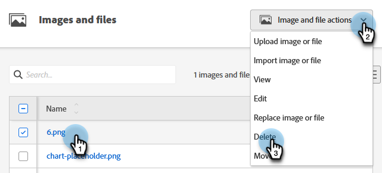

# 업로드된 이미지 또는 파일 삭제 {#delete-an-uploaded-image-or-file}

이미지 또는 파일을 삭제하는 것은 빠르고 쉽습니다.

>[!CAUTION]
>
>일단 삭제되면 이미지 / 파일은 Marketo Engage에서 완전히 제거되며 복구 할 수 없습니다.

1. **[!UICONTROL 디자인 스튜디오]**(으)로 이동합니다.

   

1. **[!UICONTROL 이미지 및 파일 선택]**

   

1. 원하는 이미지/파일을 찾아 선택합니다. **[!UICONTROL 이미지 및 파일 작업]** 드롭다운을 클릭하고 **[!UICONTROL 삭제]**&#x200B;를 선택합니다.

   

1. 올바른 파일을 선택했는지 확인하고 **[!UICONTROL 삭제]**&#x200B;를 클릭합니다.

   

   >[!NOTE]
   >
   >Assets은 현재 사용 중인 경우 삭제되지 않습니다.

>[!MORELIKETHIS]
>
>* [업로드된 이미지 또는 파일 바꾸기](/help/marketo/product-docs/demand-generation/images-and-files/replace-an-uploaded-image-or-file.md){target="_blank"}
>* [업로드된 이미지 및 파일 검색](/help/marketo/product-docs/demand-generation/images-and-files/search-uploaded-images-and-files.md){target="_blank"}
>* [업로드된 이미지 또는 파일의 URL 찾기](/help/marketo/product-docs/demand-generation/images-and-files/find-the-url-of-an-uploaded-image-or-file.md){target="_blank"}
