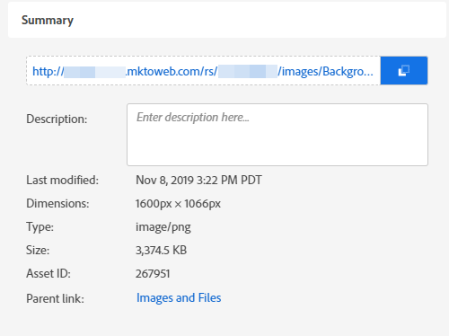

# 업로드된 이미지 또는 파일의 URL 찾기 {#find-the-url-of-an-uploaded-image-or-file}

업로드한 이미지 또는 파일의 웹 주소(URL)를 찾고 계십니까?

1. **[!UICONTROL Design Studio]**(으)로 이동합니다.

   

1. **[!UICONTROL Images and Files]**&#x200B;를 클릭합니다.

   

1. 원하는 자산을 선택합니다.

   

1. **[!UICONTROL URL]**&#x200B;이(가) 세부 정보 페이지에 표시됩니다.

   

>[!MORELIKETHIS]
>
>[업로드된 이미지 또는 파일 바꾸기](/help/marketo/product-docs/demand-generation/images-and-files/replace-an-uploaded-image-or-file.md){target="_blank"}
