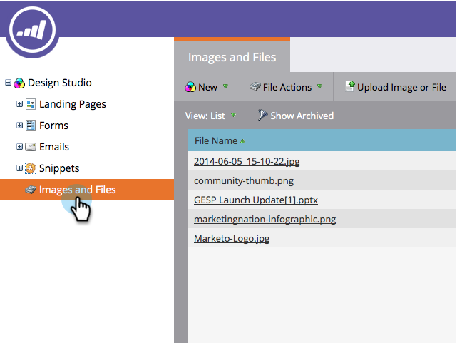

# 웹 페이지에서 이미지 가져오기 {#grab-the-images-from-a-web-page}

웹 페이지에서 이미지를 추가하려면 원하는 이미지가 있는 페이지의 웹 주소(URL)를 복사한 다음 간단한 단계를 수행합니다.

1. Design **Studio** 로 **이동합니다**.

   

1. [웹 **에서** 새로 만들기] 및 [이미지 **잡기]를 클릭합니다**.

   

1. [ **이미지 및 파일** ] 폴더를 선택하고 URL 텍스트 상자에 웹 주소(URL)를 붙여 넣은 다음 [ **다음]을 클릭합니다.**

   

   >[!NOTE]
   >
   >이 기능은 이미지를 직접 가리키는 URL에서는 작동하지 않습니다. 이미지가 포함된 웹 페이지의 URL을 사용합니다.

1. 추가할 이미지를 선택하고 가져오기를 **클릭합니다.**

   

1. 이제 이미지를 가져와 이메일 및 랜딩 페이지에서 사용할 수 있습니다.

   

1. 사용 가능한 모든 이미지를 **이미지와 파일에서 볼 수 있습니다**.

   

잘했어요, 이미지 마스터!

>[!MORELIKETHIS]
>
>* [Marketing에 이미지 및 파일 추가](add-images-and-files-to-marketo.md)
>* [폴더를 사용하여 이미지 및 파일 구성](organize-your-images-and-files-using-folders.md)
>* [업로드된 이미지 또는 파일의 URL 찾기](find-the-url-of-an-uploaded-image-or-file.md)
>* [상자에서 이미지 및 파일 업로드](upload-images-and-files-from-box.md)

>

