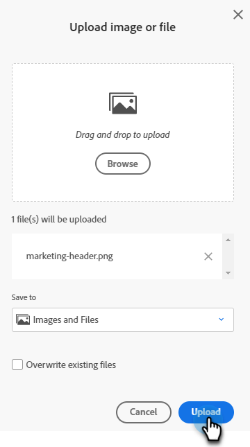
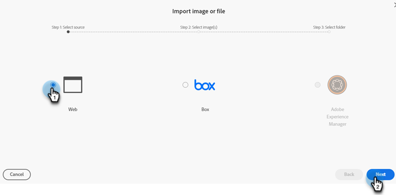

# 새 이미지 추가 문서 {#new-add-images-doc}

이미지 및 파일 저장소에 새 파일/이미지를 추가하는 여러 가지 옵션이 있습니다.

## 이미지 또는 파일 업로드 {#upload-image-or-file}

1. 로 이동 **Design Studio**.

   

1. 선택 **[!UICONTROL 이미지 및 파일]**

   

1. 다음을 클릭합니다. **[!UICONTROL 이미지 및 파일 작업]** 드롭다운 및 선택 **[!UICONTROL 이미지 또는 파일 업로드]**.

   

1. 원하는 이미지/파일을 드래그 앤 드롭하거나 컴퓨터에서 찾습니다.

   

1. 자산을 선택한 후 을(를) 클릭합니다. **업로드**.

   

## 이미지 또는 파일 가져오기 {#import-image-or-file}

이미지를 가져오는 세 가지 옵션이 있습니다. 각각 검토해 봅시다.

### 웹에서 가져오기 {#import-from-the-web}

텍스트

1. 1단계와 2단계 수행 [위에서](#upload-image-or-file).

1. 다음을 클릭합니다. **[!UICONTROL 이미지 및 파일 작업]** 드롭다운 및 선택 **[!UICONTROL 이미지 또는 파일 가져오기]**.

   

1. 다음 항목 선택 **웹** 옵션을 선택합니다.

   

1. 텍스트

PICC

### Box에서 가져오기 {#import-from-box}

텍스트

1. 1단계와 2단계 수행 [위에서](#upload-image-or-file).

1. 다음을 클릭합니다. **[!UICONTROL 이미지 및 파일 작업]** 드롭다운 및 선택 **[!UICONTROL 이미지 또는 파일 가져오기]**.

PICC

1. 텍스트

### Adobe Experience Manager에서 가져오기 {#import-from-adobe-experience-manager}

텍스트

1. 1단계와 2단계 수행 [위에서](#upload-image-or-file).

1. 다음을 클릭합니다. **[!UICONTROL 이미지 및 파일 작업]** 드롭다운 및 선택 **[!UICONTROL 이미지 또는 파일 가져오기]**.

PICC

1. 텍스트
