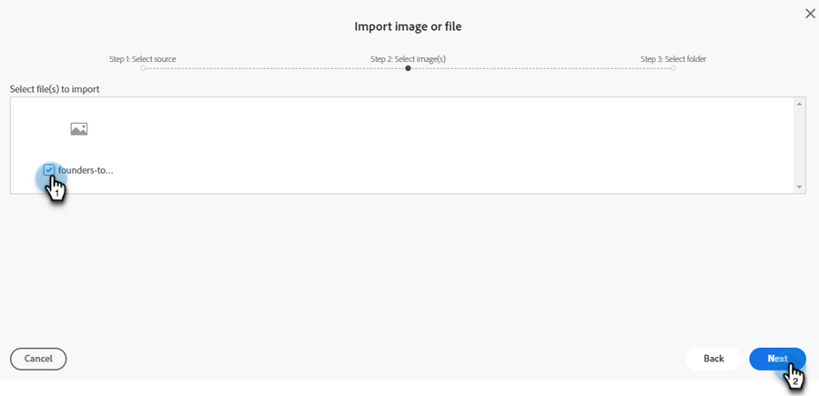
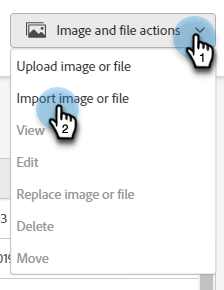

# 새 이미지 추가 문서 {#new-add-images-doc}

이미지 및 파일 저장소에 새 파일/이미지를 추가하는 여러 가지 옵션이 있습니다.

## 이미지 또는 파일 업로드 {#upload-image-or-file}

1. **디자인 스튜디오**(으)로 이동합니다.

   

1. **[!UICONTROL Images and Files]** 선택

   

1. **[!UICONTROL Image and file actions]** 드롭다운을 클릭하고 **[!UICONTROL Upload image or file]**&#x200B;를 선택합니다.

   

1. 원하는 이미지/파일을 드래그 앤 드롭하거나 컴퓨터에서 찾습니다.

   

1. 자산을 선택한 후 **업로드**&#x200B;를 클릭합니다.

   

## 이미지 또는 파일 가져오기 {#import-image-or-file}

이미지를 가져오는 세 가지 옵션이 있습니다. 각각 검토해 봅시다.

### 웹에서 가져오기 {#import-from-the-web}

텍스트

1. 위의 [에서 1단계 및 2단계 ](#upload-image-or-file)을(를) 따릅니다.

1. **[!UICONTROL Image and file actions]** 드롭다운을 클릭하고 **[!UICONTROL Import image or file]**&#x200B;를 선택합니다.

   

1. **[!UICONTROL Web]** 옵션을 선택하고 **[!UICONTROL Next]**&#x200B;을(를) 클릭합니다.

   

1. 원하는 이미지에 대한 URL을 입력하거나 붙여 넣고 **다음**&#x200B;을 클릭합니다.

PICC

1. 빈 을 클릭합니다.

PICC

### Box에서 가져오기 {#import-from-box}

텍스트

1. 위의 [에서 1단계 및 2단계 ](#upload-image-or-file)을(를) 따릅니다.

1. **[!UICONTROL Image and file actions]** 드롭다운을 클릭하고 **[!UICONTROL Import image or file]**&#x200B;를 선택합니다.

   

1. **[!UICONTROL Box]** 옵션을 선택하고 **[!UICONTROL Next]**&#x200B;을(를) 클릭합니다.

   

   >[!NOTE]
   >
   >이전에 그렇게 하지 않았다면 액세스 권한을 부여하기 위해 Box 계정에 로그인하라는 메시지가 표시됩니다.

1. 원하는 Box 폴더를 선택하고 **[!UICONTROL Next]**&#x200B;을(를) 클릭합니다.

   

1. 원하는 이미지를 선택하고 **[!UICONTROL Next]**&#x200B;을(를) 클릭합니다.

   

1. 이미지를 저장할 Marketo Engage 폴더를 선택합니다. 이 예제에서는 이미지 및 파일(기본값)로 둡니다. **가져오기**&#x200B;를 클릭합니다.

   

### Adobe Experience Manager에서 가져오기 {#import-from-adobe-experience-manager}

텍스트

1. 위의 [에서 1단계 및 2단계 ](#upload-image-or-file)을(를) 따릅니다.

1. **[!UICONTROL Image and file actions]** 드롭다운을 클릭하고 **[!UICONTROL Import image or file]**&#x200B;를 선택합니다.

   

1. **[!UICONTROL Adobe Experience Manager]** 옵션을 선택하고 **[!UICONTROL Next]**&#x200B;을(를) 클릭합니다.

   

   >[!NOTE]
   >
   >이전에 로그인하지 않았다면 AEM 계정에 로그인하라는 메시지가 표시됩니다.

1. 텍스트

PICC

1. 텍스트

PICC

1. 텍스트
