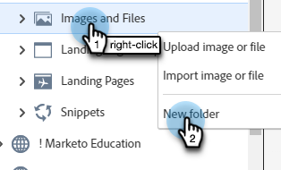

# 폴더를 사용하여 이미지 및 파일 구성 {#organize-your-images-and-files-using-folders}

폴더를 만들면 이미지와 파일을 이동하고, 원하는 이미지 세트만 확인하고, 특정 폴더에 직접 업로드할 수 있습니다.

1. **[!UICONTROL Design Studio]**(으)로 이동합니다.

   

1. **[!UICONTROL Images and Files]**&#x200B;을(를) 마우스 오른쪽 단추로 클릭하고 **[!UICONTROL New folder]**&#x200B;을(를) 선택합니다.

   

1. 폴더 이름을 지정하고 **[!UICONTROL Create]**&#x200B;를 클릭합니다.

   

1. **[!UICONTROL Images and Files]**(으)로 돌아가서 이동할 자산을 선택합니다. **[!UICONTROL Image and file actions]** 드롭다운을 클릭하고 **[!UICONTROL Move]**&#x200B;를 선택합니다.

   

1. 원하는 폴더를 선택합니다.

   

1. **오전이동**&#x200B;을 클릭합니다.

   

>[!MORELIKETHIS]
>
>[업로드된 이미지 및 파일 검색](/help/marketo/product-docs/demand-generation/images-and-files/search-uploaded-images-and-files.md){target="_blank"}
