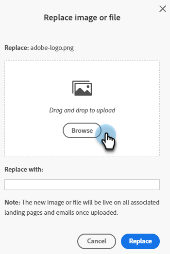

# 업로드한 이미지 또는 파일 바꾸기 {#replace-an-uploaded-image-or-file}

1. **[!UICONTROL 디자인 스튜디오]**(으)로 이동합니다.

   

1. **[!UICONTROL 이미지 및 파일]**&#x200B;을 클릭합니다.

   

1. 바꿀 자산을 선택합니다. **[!UICONTROL 이미지 및 파일 작업]** 드롭다운을 클릭하고 **[!UICONTROL 이미지 또는 파일 바꾸기]**&#x200B;를 선택합니다.

   

1. 컴퓨터를 드래그 앤 드롭하거나 찾아 교체 이미지/파일을 찾습니다.

   

   >[!NOTE]
   >
   >대체 파일 유형은 원본(예: .jpg)과 동일해야 합니다.

1. 대체 이미지/파일을 선택한 후 **[!UICONTROL 바꾸기]**&#x200B;를 클릭합니다.

   

   >[!NOTE]
   >
   >대체 파일의 이름은 이전 파일의 이름과 일치하도록 변경됩니다.

잘했어!

>[!MORELIKETHIS]
>
>* [업로드된 이미지 및 파일 검색](/help/marketo/product-docs/demand-generation/images-and-files/search-uploaded-images-and-files.md){target="_blank"}
>* [업로드된 이미지 또는 파일의 URL 찾기](/help/marketo/product-docs/demand-generation/images-and-files/find-the-url-of-an-uploaded-image-or-file.md){target="_blank"}
