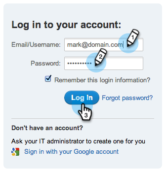

# 상자에서 이미지 및 파일 업로드 {#upload-images-and-files-from-box}

Box에서 파일을 업로드하여 랜딩 페이지와 이메일에 사용할 수 있습니다.

1. Design **Studio** 로 **이동합니다**.

   

1. ** 이미지 및 파일**로 이동합니다. 파일 **작업을** 클릭하고 **웹에서 이미지**&#x200B;잡기를 선택합니다.

   

1. 상자를 **클릭합니다**.

   

1. 상자 로그인을 입력합니다.

   

1. Marketing에서 Box 계정에 액세스할 수 있도록 허용

   

1. 파일을 저장할 위치를 선택합니다. 그런 다음 업로드할 **Box** 폴더를 선택합니다. 다음을 **클릭합니다**.

   

1. 업로드할 파일을 선택합니다. 가져오기를 **클릭합니다**.

   

이제 랜딩 페이지와 이메일에 파일을 사용할 수 있습니다.