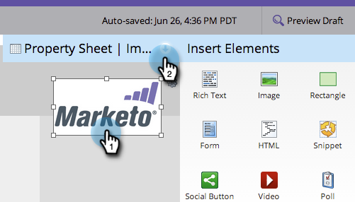

# 자유 형식 랜딩 페이지 이미지에 링크 추가 {#add-a-link-to-a-free-form-landing-page-image}

>[!PREREQUISITES]
>
>[자유 형식 랜딩 페이지에 이미지 추가](/help/marketo/product-docs/demand-generation/landing-pages/free-form-landing-pages/add-an-image-to-a-free-form-landing-page.md)

>[!NOTE]
>
>이는 자유 형식 랜딩 페이지에만 적용됩니다.

1. 랜딩 페이지에 추가한 이미지를 선택하고 **[!UICONTROL Property Sheet]**&#x200B;을(를) 확장합니다.

   

1. **[!UICONTROL linkUrl]**&#x200B;에 mailto 링크를 입력합니다.

   

   이제 이미지가 Marketo 랜딩 페이지에 이메일 링크로 표시됩니다.

   
