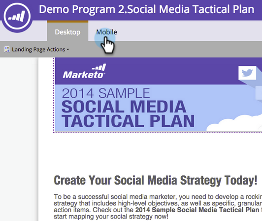

# 자유로운 형식의 랜딩 페이지에 대한 모바일 보기 추가 {#add-a-mobile-view-for-your-free-form-landing-page}

스마트폰에서 형식에 구애 받지 않는 랜딩 페이지를 손쉽게 만들 수 있습니다.

>[!NOTE]
>
>모바일 보기는 480px 너비(또는 이하)인 화면에서 작동합니다. 스마트폰. 디바이스 해상도에 대한 자세한 [내용을 살펴보십시오](http://mydevice.io/devices/.).

1. 마케팅 활동 **으로 이동합니다**.

   

1. 자유로운 형식의 랜딩 페이지를 선택합니다.

   

1. 초안 **편집을 클릭합니다**.

   

1. 모바일 **탭을** 클릭합니다.

   

1. 활성화를 **클릭합니다**.

   

   >[!CAUTION]
   >
   >자유 형식 템플릿을 업그레이드해야 할 수도 있습니다. 이 메시지가 표시되면 기존 자유 형식의 랜딩 페이지 템플릿을 모바일 [과 호환되는](../../../../product-docs/demand-generation/landing-pages/landing-page-templates/make-an-existing-free-form-landing-page-template-mobile-compatible.md)방법을 빠르게 살펴보십시오.

1. 좋아요! 이제 랜딩 페이지의 모바일 버전을 활성화했습니다. **닫기를 클릭합니다. **

   

   이제 모바일 [보기를 사용자 정의할 수 있습니다](customize-mobile-view-for-your-free-form-landing-page.md).

   

>[!MORELIKETHIS]
>
>* [자유로운 형식의 랜딩 페이지에 맞게 모바일 보기 사용자 정의](customize-mobile-view-for-your-free-form-landing-page.md)

>

