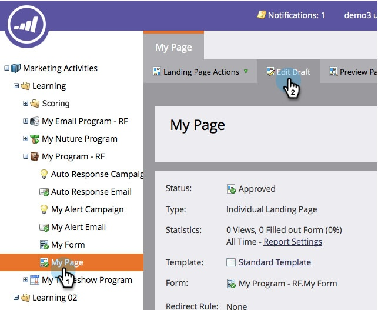

# 자유 형식 랜딩 페이지 {#add-a-social-button-to-a-free-form-landing-page}에 소셜 단추 추가

소셜 단추는 사람들이 자신의 컨텐츠를 친구와 공유할 수 있도록 합니다. 무료 랜딩 페이지, Facebook 및 웹 사이트에 게시할 수 있습니다.

>[!NOTE]
>
>**가용성**
>
>모든 고객이 이 기능을 구입하지는 않았습니다. 자세한 내용은 영업 담당자에게 문의하십시오.

1. 자유 형식의 랜딩 페이지로 이동하고 **초안 편집**&#x200B;을 클릭합니다.

   

1. 오른쪽의 요소에서 **Social** **Button** 위로 드래그합니다.

   

1. **소셜 단추(Analytics 포함)를 선택합니다.**

   

   랜딩 페이지가 활성화되면 [소셜 대시보드](../../../../product-docs/demand-generation/social/social-functions/view-social-performance.md)에서 소셜 단추(Analytics 사용)로 생성된 활동을 참조하십시오.

   좋아요/권장 단추(Lite)를 대신 추가하는 경우 [랜딩 페이지 성능 보고서](../../../../product-docs/demand-generation/landing-pages/understanding-landing-pages/landing-page-performance-report.md)의 공유 수를 참조하십시오.

1. 드롭다운 메뉴에서 **새로 만들기**&#x200B;를 선택합니다.

   >[!NOTE]
   >
   >**새로 만들기** > **새 로컬 자산을 선택하여 프로그램 내에 소셜 단추를 만들 수도 있습니다.**

1. 소셜 단추의 이름을 지정하고 **클론 출처,**&#x200B;에서 **없음**&#x200B;을 선택하고 **삽입을 클릭합니다.**

   

   >[!TIP]
   >
   >시간을 절약하려면 **복제** **보낸 사람** 옵션을 사용하여 기존 소셜 단추에서 모든 설정을 복사할 수 있습니다.

   [랜딩 페이지를 Facebook에 ](../../../../product-docs/demand-generation/facebook/publish-landing-pages-to-facebook.md) [게시웹 사이트의 소셜 단추 게시](../../../../product-docs/demand-generation/social/social-functions/deploy-social-on-your-website.md)

축하합니다! 랜딩 페이지에 소셜 단추를 추가했습니다. 랜딩 페이지를 승인해야 합니다.

>[!MORELIKETHIS]
>
>완료되면 소셜 단추 설정을 변경할 수 있습니다. [단추 스타일 ](../../../../product-docs/demand-generation/social/configuring-social-actions/customize-social-app-button.md) 또는 [공유 메시지 편집](../../../../product-docs/demand-generation/social/configuring-social-actions/configure-social-sign-up-share-flow.md)으로 시작합니다.
