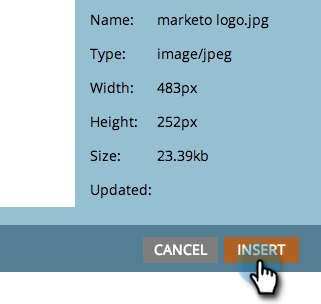

# 자유 형식 랜딩 페이지에 이미지 추가 {#add-an-image-to-a-free-form-landing-page}

>[!PREREQUISITES]
>
>[Marketo에 이미지 및 파일 추가](/help/marketo/product-docs/demand-generation/images-and-files/add-images-and-files-to-marketo.md)

1. 자유 형식의 랜딩 페이지를 선택하고 **[!UICONTROL Edit Draft]**&#x200B;을(를) 클릭합니다.

   

1. 편집기에서 **[!UICONTROL Image]** 요소 위로 끕니다.

   

1. 원하는 이미지를 찾아 선택합니다.

   

1. **[!UICONTROL Insert]**&#x200B;를 클릭합니다.

   

   좋습니다! 방금 자유 형식 랜딩 페이지에 이미지를 추가했습니다.

   
