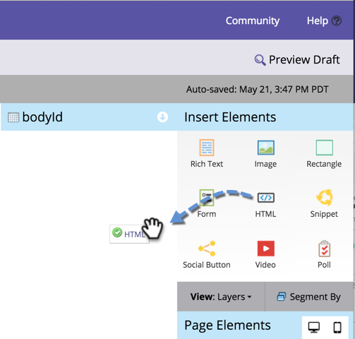

# 자유 형식 랜딩 페이지에 사용자 정의 HTML 추가 {#adding-custom-html-to-a-free-form-landing-page}

사용자 지정 스크립트, CSS 또는 기타 HTML을 랜딩 페이지에 추가할 수 있습니다.

>[!NOTE]
>
>Marketo Engage 지원 은 사용자 지정 HTML 문제 해결을 지원하기 위해 설정되어 있지 않습니다. HTML 지원이 필요한 경우 웹 개발자에게 문의하십시오.

1. 랜딩 페이지를 선택하고 **[!UICONTROL Edit Draft]**&#x200B;을(를) 클릭합니다.

   

1. 랜딩 페이지 편집기에서 **HTML** 요소를 드래그합니다.

   

1. 사용자 지정 HTML 코드를 입력하고 **[!UICONTROL Save]**&#x200B;을(를) 클릭합니다.

   

스크립트나 CSS를 HTML 요소에 추가할 수 있습니다.

>[!TIP]
>
>가능하면 랜딩 페이지에 배포하기 전에 로컬 환경에서 사용자 지정 HTML 소스를 테스트하십시오.

>[!CAUTION]
>
>사용자 지정 HTML이 비렌더링(예: 보이지 않는 JavaScript 함수 또는 CSS)인 경우 요소를 왼쪽 상단과 같은 기억할 수 있는 위치에 놓습니다. 요소 아웃라인은 해당 영역을 클릭할 때만 표시됩니다.
