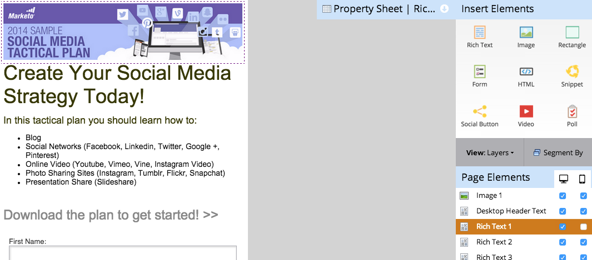

# 자유 형식 랜딩 페이지 {#customize-mobile-view-for-your-free-form-landing-page}에 대한 모바일 보기 사용자 지정

>[!PREREQUISITES]
>
>* [자유로운 형식의 랜딩 페이지에 대한 모바일 보기 추가](add-a-mobile-view-for-your-free-form-landing-page.md)

>

자유 형식 랜딩 페이지의 모바일 보기는 대부분 자동으로 설정되지만 사용자 정의할 수 있습니다. 방법

1. 자유 형식의 랜딩 페이지를 선택합니다.

   

1. **초안 편집**&#x200B;을 클릭합니다.

   

1. **모바일** 탭을 클릭합니다.

   

## 모바일과 데스크탑 보기 비교 {#mobile-vs-desktop-view}

페이지 요소 아래에 (데스크탑) 아이콘과 (모바일) 아이콘이 표시됩니다. 이렇게 하면 여러 요소를 동적으로 표시하거나 숨길 수 있습니다.

기본적으로 데스크톱 보기의 모든 항목이 모바일 보기에 표시됩니다.

>[!NOTE]
>
>사각형이 모바일 보기에 표시되지 않습니다.

## 알아야 할 중요한 사항: {#important-things-to-know}

* 이미지는 모바일 장치의 너비로 확장됩니다. 더 작은 이미지를 원하는 경우 리치 텍스트 요소를 가져와서 여기에서 이미지를 추가합니다.
* Forms 2.0 양식만 사용합니다. 반응형으로 자동으로 조정됩니다.
* 하나의 템플릿 요소만 편집할 수 있으며 BODY#bodyid(모바일). 이것을 사용하여 배경색을 변경할 수 있습니다.\
   

## 모바일 보기 {#hide-an-element-from-the-mobile-view}에서 요소 숨기기

>[!TIP]
>
>모바일 디바이스에서 더 적은 콘텐츠 제작 보다 쾌적한 고객에게 더 적은 수의 단어를 사용할 수 있습니다.

1. 요소를 숨기려면 모바일 열 아래의 해당 확인란을 클릭합니다.

   

1. 완벽해! 해당 요소는 더 이상 모바일 보기에 표시되지 않습니다.

   

## 모바일 보기에 요소 추가 {#add-an-element-to-the-mobile-view}

>[!TIP]
>
>모바일 보기용으로 특수(더 짧은) 콘텐츠를 만들 수 있습니다.

1. 요소를 추가하려면 요소를 자유형 랜딩 페이지에 드래그하여 놓습니다.

   

   요소가 모바일 보기에서만 표시되도록 설정되어 있는지 확인합니다.

   

>[!TIP]
>
>모바일 보기에는 페이지 요소의 다른 정렬도 있을 수 있습니다. 자유 형식의 랜딩 페이지에서 개체를 이동하거나 드래그하여 놓기를 사용하여 **페이지 요소** 아래에 나열된 개체의 순서를 다시 지정합니다.

## 모바일 보기 미리 보기 {#preview-mobile-view}

1. **초안 미리 보기**&#x200B;를 클릭합니다.

   

1. 멋진 것을 보고 싶으세요? **나란히**&#x200B;을 선택합니다.

   

1. 이제 랜딩 페이지의 데스크탑 및 모바일 버전을 동시에 볼 수 있습니다!

   

1. 마음에 드는 경우 **승인 및 닫기**&#x200B;를 클릭합니다.

   

   >[!NOTE]
   >
   >미리 보기가 대화형이 아닙니다. 모든 스마트폰은 화면을 조금 다르게 표시합니다. 랜딩 페이지가 어떻게 동작하는지 정확하게 확인하려면 몇 개의 장치에서 랜딩 페이지를 미리 보는 것이 좋습니다.

재미있게 놀아라!

>[!NOTE]
>
>**관련 문서**
>
>* [기존 자유 형식 랜딩 페이지 템플릿 모바일과 호환되도록 만들기](../../../../product-docs/demand-generation/landing-pages/landing-page-templates/make-an-existing-free-form-landing-page-template-mobile-compatible.md)

>

