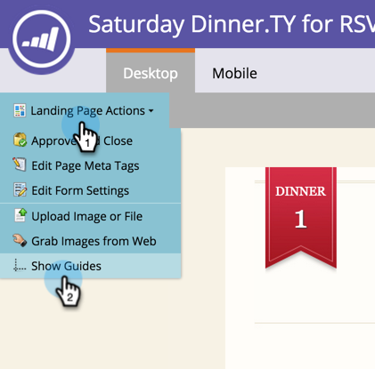

# 자유 형식 랜딩 페이지 디자인에 가이드 사용 {#use-guides-for-free-form-landing-page-design}

자유 형식의 랜딩 페이지를 디자인할 때 안내선을 사용하여 페이지에서 요소를 정렬할 수 있습니다.

>[!NOTE]
>
>안내서는 **[!UICONTROL Free-form]** 랜딩 페이지 편집기에서만 사용할 수 있습니다.

1. **[!UICONTROL Landing Page]**&#x200B;을(를) 선택하고 **[!UICONTROL Edit Draft]**&#x200B;을(를) 클릭합니다.

   

1. **[!UICONTROL Landing Page Actions]**&#x200B;을(를) 클릭하고 **[!UICONTROL Show Guides]**&#x200B;을(를) 선택합니다.

   

1. 캔버스 위에 세로 및 가로 안내선이 나타납니다. 커서를 사용하여 이동합니다.

   

1. 선 위로 개체를 드래그합니다. 선이 너비를 두 배로 늘리고 개체가 안내선에 스냅될 때 놓으십시오.

   

   적절하게 정렬된 요소는 보다 깔끔하고 전문적인 레이아웃을 만듭니다.
