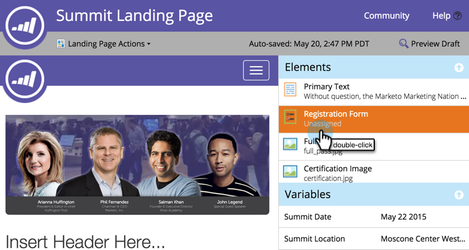

# 안내 랜딩 페이지에 양식 추가 {#add-a-form-to-a-guided-landing-page}

양식, 미팅 랜딩 페이지. 랜딩 페이지, 미팅 양식

>[!PREREQUISITES]
>
>[안내 랜딩 페이지 만들기](/help/marketo/product-docs/demand-generation/landing-pages/guided-landing-pages/create-a-guided-landing-page.md)

1. **마케팅 활동** 영역으로 이동합니다.

   

1. 랜딩 페이지를 찾아 선택하고 **초안 편집**&#x200B;을 클릭합니다.

   

   >[!NOTE]
   >
   >안내 랜딩 페이지에서 사용 가능한 요소는 템플릿에 의해 정의됩니다. 요소 패널에 양식이 표시되지 않으면 새 템플릿을 선택하거나 템플릿 작성자에게 문의하십시오.

1. 요소 패널에서 **양식**&#x200B;을 두 번 클릭합니다.

   

1. 추가할 양식을 선택합니다.

   

1. 후속 페이지를 선택할 때는 다음 3가지 옵션이 있습니다.

   * 랜딩 페이지 - 마케팅 랜딩 페이지 선택
   * 외부 URL - 원하는 URL 선택
   * 정의된 양식 - 양식 수준에서 정의된 설정을 사용합니다.

   >[!NOTE]
   >
   >후속 페이지는 양식을 제출한 후에 사람들이 보게 될 페이지입니다.

1. 이 예에서는 정의된 양식을 사용합니다. **삽입**&#x200B;을 클릭합니다.

   

   잘했다!

   

이제 랜딩 페이지 편집기를 닫고 [랜딩 페이지 초안 승인](/help/marketo/product-docs/demand-generation/landing-pages/understanding-landing-pages/approve-unapprove-or-delete-a-landing-page.md).
