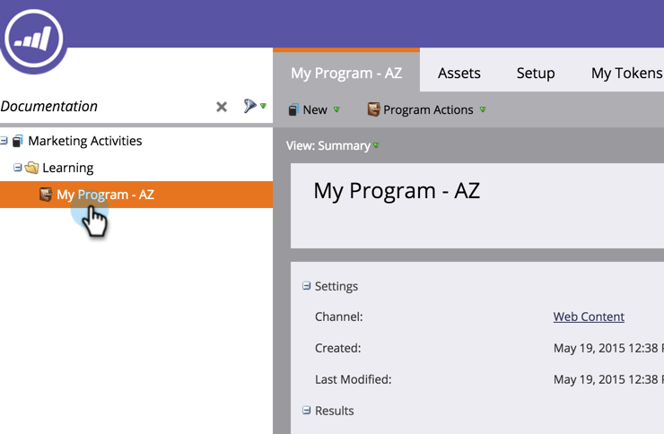

# 안내 랜딩 페이지 만들기 {#create-a-guided-landing-page}

>[!NOTE]
>
>랜딩 페이지 모드는 해당 템플릿으로 정의됩니다. [자유 형식 및 안내 랜딩 페이지 템플릿에 ](/help/marketo/product-docs/demand-generation/landing-pages/understanding-landing-pages/understanding-free-form-vs-guided-landing-pages.md) 대해 자세히 알아보십시오.

>[!PREREQUISITES]
>
>사용자 지정 템플릿을 사용하려면 먼저 [안내 랜딩 페이지 템플릿](/help/marketo/product-docs/demand-generation/landing-pages/landing-page-templates/create-a-guided-landing-page-template.md)을 만들어야 합니다.

## 프로그램 {#create-a-guided-landing-page-in-a-program}에서 안내 랜딩 페이지 만들기

안내 랜딩 페이지는 프로그램의 로컬 에셋으로 만들 수도 있고, Design Studio에서 만들어 전체적으로 사용할 수도 있습니다.

1. **마케팅 활동**&#x200B;으로 이동합니다.

   

1. 프로그램을 선택합니다.

   

1. **새로 만들기** 드롭다운을 클릭합니다. **새 로컬 자산**&#x200B;을 선택합니다.

   

1. **랜딩 페이지**&#x200B;를 선택합니다.

   

1. 랜딩 페이지의 이름을 지정합니다. **템플릿** 드롭다운을 클릭하고 **안내 템플릿**&#x200B;을 선택합니다.

   >[!NOTE]
   >
   >안내 랜딩 페이지 템플릿 옆에  아이콘이 있습니다. 안내 템플릿은 완전히 응답성을 유지할 수 있도록 구조화되어 있습니다.

   

## Design Studio {#create-a-landing-page-in-design-studio}에서 랜딩 페이지 만들기

1. **Design Studio**&#x200B;로 이동합니다.

   

1. **새로 만들기** 드롭다운을 클릭합니다. **새 랜딩 페이지**&#x200B;를 선택합니다.

   

1. 랜딩 페이지의 이름을 지정합니다. **템플릿** 드롭다운을 클릭하고 **안내 템플릿**&#x200B;을 선택합니다.

   

1. **만들기**&#x200B;를 클릭합니다.

   

>[!TIP]
>
>URL은 프로그램과 랜딩 페이지 이름에서 자동으로 생성됩니다. URL을 변경하려면 **페이지 URL** 필드를 편집합니다.
>
>**만들기**&#x200B;를 클릭한 후 편집기를 바로 열지 않으려면 **편집기에서 열기 확인란을 선택 취소합니다.**
