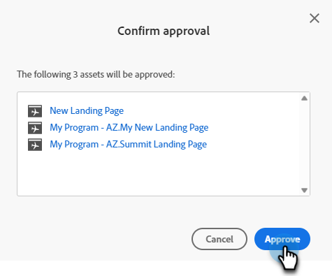

# 여러 랜딩 페이지를 한 번에 승인 {#approve-multiple-landing-pages-at-once}

1. **[!UICONTROL Design Studio]** 으로 이동합니다.

   

1. **[!UICONTROL Landing Pages]**&#x200B;를 클릭합니다.

   

1. 원하는 랜딩 페이지를 선택합니다.

   

   >[!TIP]
   >
   >실제 랜딩 페이지 이름을 클릭하지 마십시오. 이 이름은 링크이며 페이지 자체로 이동합니다.

1. 랜딩 페이지를 선택한 상태에서 **[!UICONTROL Landing Page Actions]** 드롭다운을 클릭하고 **[!UICONTROL Approve]**&#x200B;을(를) 선택합니다.

   

1. **[!UICONTROL Approve]**&#x200B;를 클릭합니다.

   

   >[!TIP]
   >
   >비승인 또는 삭제와 같은 다른 벌크 옵션에도 위 단계를 사용할 수 있습니다.
