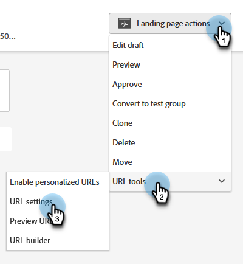

# 랜딩 페이지 URL 변경 {#change-the-landing-page-url}

랜딩 페이지의 URL을 수정할 수 있습니다. 이렇게 하면 URL을 보다 쉽게 기억하고 SEO를 개선할 수 있습니다.

1. 원하는 랜딩 페이지를 찾아 선택합니다.

   

1. **랜딩 페이지 작업** 드롭다운을 클릭하고 **URL 도구**(으)로 스크롤한 다음 **URL 설정**&#x200B;을 선택합니다.

   

1. **[!UICONTROL New URL]**&#x200B;을(를) 입력하고 이전 URL을 삭제하거나 리디렉션하도록 선택한 다음 **[!UICONTROL Save]**&#x200B;을(를) 클릭합니다.

   

   >[!NOTE]
   >
   >두 URL을 모두 유지하기로 결정하면 리디렉션 규칙이 자동으로 만들어집니다. [URL 리디렉션](/help/marketo/product-docs/demand-generation/landing-pages/personalizing-landing-pages/redirect-a-url-path.md)에 대해 자세히 알아보세요.
