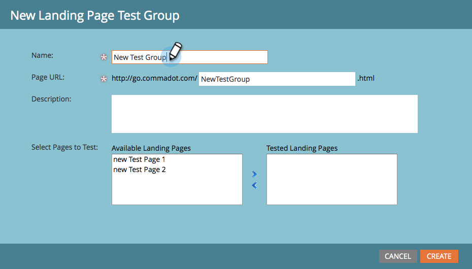

# 랜딩 페이지 테스트 그룹 복제 {#cloning-a-landing-page-test-group}

Design Studio에서 랜딩 페이지 테스트 그룹을 찾아 복제할 수 있습니다.

1. 승인되지 않은 페이지를 마우스 오른쪽 단추로 클릭합니다. 선택 **복제**.

   

1. 이 복제된 페이지에 새 정보 제공 **이름**. 복제된 페이지가 현재 폴더 하단에 나타납니다.

   

1. 이제 다음을 클릭하여 새 테스트 그룹을 만듭니다 **새로 만들기** 및 선택 **새 테스트 그룹**.

   

1. 새 랜딩 페이지 만들기 대화 상자에서 새 테스트 그룹을 입력합니다 **이름**.

   

1. 대화 상자의 하단에서 복제된 페이지를 선택합니다 **사용 가능한 랜딩 페이지** 목록을 표시하고 오른쪽 화살표를 클릭하여 여기에 포함합니다 **테스트한 랜딩 페이지**. 이 그룹에서 원하는 모든 랜딩 페이지에 대해 이 작업을 수행합니다.

   

1. 완료되면 을(를) 클릭합니다. **만들기**.

   

1. 테스트 그룹을 시작할 준비가 되면 트리에서 그룹을 마우스 오른쪽 단추로 클릭하고 선택합니다 **테스트 그룹 승인**.

   

   이제 그룹이 방문 및 양식 완료 를 적극적으로 추적하여 어느 랜딩 페이지가 가장 성과가 좋은지 확인할 수 있습니다.
