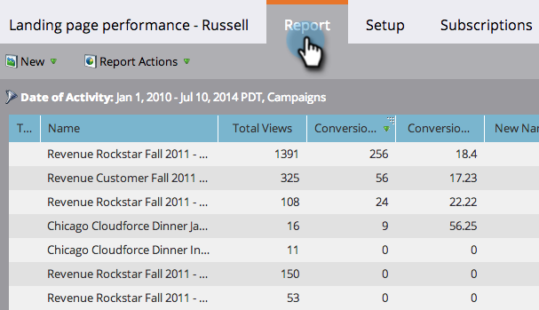

# 랜딩 페이지 성능 보고서 필터링 {#filter-a-landing-page-performance-report}

프로그램(로컬 자산)의 랜딩 페이지, Design Studio(전역 자산) 또는 보관된 [랜딩 페이지 등에 랜딩 페이지 성과 보고서를](../../../../product-docs/demand-generation/landing-pages/understanding-landing-pages/landing-page-performance-report.md) 집중시킬 수 있습니다.

1. Analytics **** (또는 **마케팅 활동**)로 이동합니다.

   

1. 탐색 트리에서 랜딩 페이지 보고서를 선택합니다.

   

1. 설정 **탭을** 클릭하고 필터를 드래그합니다.

   

   * **Design Studio 랜딩 페이지:** Design Studio에서 관리되는 전역 에셋
   * **마케팅 활동 랜딩 페이지:** 마케팅 활동 탭에서 프로그램의 로컬 자산입니다.
   * **보관된 랜딩 페이지:** 비활성, 중단된 랜딩 페이지.

1. 보고서에 포함할 폴더 및 특정 랜딩 페이지를 선택합니다.

   

   >[!TIP]
   >
   >폴더를 선택하면 보고서가 실행될 때 해당 폴더에 포함된 모든 항목이 보고서에 포함됩니다.

1. 이제 끝났어요! 필터링된 보고서 **를** 보려면 보고서 탭을 클릭하십시오.

   

>[!NOTE]
>
>**딥 다이브**
>
>기본 보고의 보고서에 대한 모든 [내용을 살펴볼 수 있습니다](http://docs.marketo.com/display/docs/basic+reporting).

