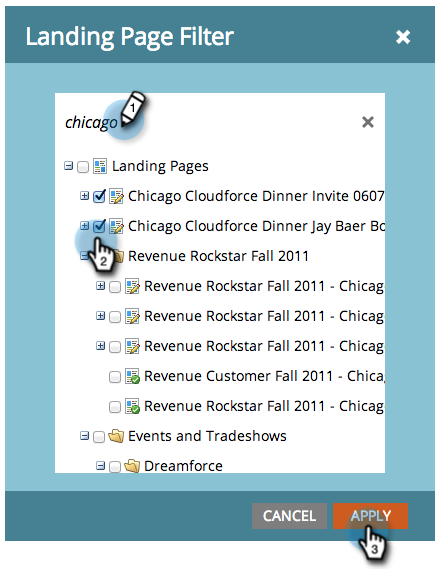

# 랜딩 페이지 성과 보고서 필터링 {#filter-a-landing-page-performance-report}

[랜딩 페이지 성과 보고서](/help/marketo/product-docs/demand-generation/landing-pages/understanding-landing-pages/landing-page-performance-report.md)를 프로그램의 랜딩 페이지(로컬 자산), [!UICONTROL Design Studio]의 랜딩 페이지(전역 자산) 또는 보관된 랜딩 페이지에 포커스를 둡니다.

1. **[!UICONTROL Analytics]**(또는 **[!UICONTROL Marketing Activities]**)(으)로 이동합니다.

   

1. 탐색 트리에서 랜딩 페이지 보고서를 선택합니다.

   

1. **[!UICONTROL Setup]** 탭을 클릭하고 필터를 드래그합니다.

   

   * **[!UICONTROL Design Studio Landing Pages]:**&#x200B;개의 전역 자산이 [!UICONTROL Design Studio]에서 관리됩니다.
   * **[!UICONTROL Marketing Activities Landing Pages]탭의 프로그램에 있는**:[!UICONTROL Marketing Activities] 로컬 자산입니다.
   * **[!UICONTROL Archived Landing Pages]:**&#x200B;개의 비활성, 중단된 랜딩 페이지.

1. 보고서에 포함할 폴더 및 특정 랜딩 페이지를 선택합니다.

   

   >[!TIP]
   >
   >폴더를 선택하면 보고서가 실행될 때 폴더에 포함된 모든 내용이 보고서에 포함됩니다.

1. 완료되었습니다! 필터링된 보고서를 보려면 **[!UICONTROL Report]** 탭을 클릭하십시오.

   
