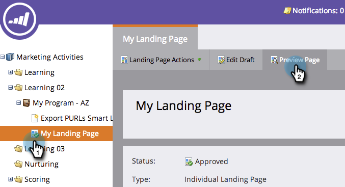

# 동적 내용 {#preview-a-landing-page-with-dynamic-content}이 있는 랜딩 페이지 미리 보기

다이내믹 컨텐츠를 추가한 후 랜딩 페이지를 미리 보고 모든 것이 의도한 대로 표시되는지 확인합니다.

>[!PREREQUISITES]
>
>* [랜딩 페이지에서 동적 컨텐츠 사용](../../../../product-docs/demand-generation/landing-pages/personalizing-landing-pages/use-dynamic-content-in-a-landing-page.md)
>* [랜딩 페이지 미리 보기](preview-a-landing-page.md)

>

1. 랜딩 페이지를 선택하고 **페이지 미리 보기를 클릭합니다.**

   

1. 드롭다운을 클릭하고 **세그먼트**&#x200B;를 선택하여 미리 봅니다.

   

굉장해! 이제 여러 세그먼트에서 랜딩 페이지가 제대로 작동하는지 확인할 수 있습니다.