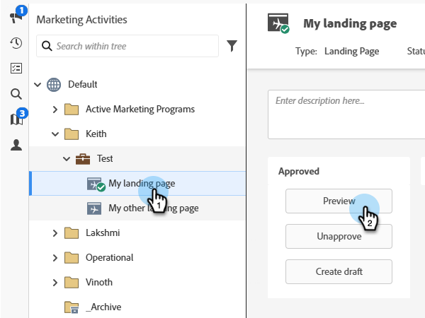

# 랜딩 페이지 미리보기 {#preview-a-landing-page}

랜딩 페이지를 미리 보고 라이브로 만들기 전에 모양을 확인합니다.

>[!IMPORTANT]
>
>일부 사용자 지정 메타 태그는 Marketo Engage의 보안을 유지하기 위해 적용된 콘텐츠 보안 정책을 위반할 수 있으므로 미리 보기 모드(예: `<meta http-equiv="refresh" ...>` 리디렉션 지시문)에서 지원되지 않습니다. 이러한 태그가 있는 랜딩 페이지는 미리 보기 URL(**미리 보기 작업** > **미리 보기 URL 생성**)을 생성한 다음 새 브라우저 창에 붙여 넣어 미리 볼 수 있습니다.

## 승인된 페이지 미리보기 {#preview-approved-page}

1. 원하는 랜딩 페이지를 선택하고 **[!UICONTROL Preview]**&#x200B;을(를) 클릭합니다.

   

랜딩 페이지를 마우스 오른쪽 단추로 클릭하고 **[!UICONTROL Preview]**&#x200B;을(를) 선택할 수도 있습니다.

## 초안 미리 보기 {#preview-a-draft}

1. 원하는 랜딩 페이지를 선택하고 **[!UICONTROL Preview draft]**&#x200B;을(를) 클릭합니다.

   

>[!NOTE]
>
>초안은 고객이 보는 라이브 버전이 아니라 작업 중인 버전입니다.

## 편집하는 동안 랜딩 페이지 초안 미리 보기 {#preview-a-draft-while-editing}

1. 원하는 랜딩 페이지를 선택하고 **[!UICONTROL Edit draft]**&#x200B;을(를) 클릭합니다.

   

1. 랜딩 페이지 편집기에서 **[!UICONTROL Preview draft]**&#x200B;을(를) 클릭합니다.

   

1. **[!UICONTROL Edit draft]**&#x200B;을(를) 클릭하여 편집으로 돌아갑니다.

   
