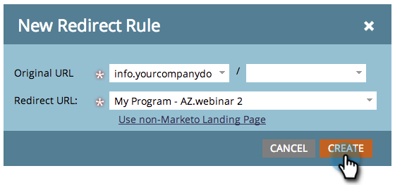

# 마케팅 랜딩 페이지를 다른 페이지 {#redirect-a-marketo-landing-page-to-another-page}로 리디렉션

페이지의 URL을 업데이트한 후 이전 URL을 계속 사용하려면 리디렉션을 시도하십시오. 손쉽게 설정할 수 있습니다.

>[!NOTE]
>
>**관리자 권한 필요**

1. **관리**&#x200B;에서 **랜딩** **페이지**&#x200B;를 클릭합니다.

   

1. **규칙** 탭에서 **새로 만들기**&#x200B;새로 만들기&#x200B;****&#x200B;리디렉션&#x200B;****&#x200B;규칙&#x200B;**을 클릭합니다.**

   

1. **첫 번째** **원본** **URL** 드롭다운을 클릭하고 [CNAME](customize-your-landing-page-urls-with-a-cname.md)을 선택합니다.

   

   >[!NOTE]
   >
   >**미리 알림**
   >
   >
   >Marketing으로 시작하는 URL만 [CNAME](customize-your-landing-page-urls-with-a-cname.md)으로 리디렉션할 수 있습니다.

1. **두번째 원본 URL** 필드에서 리디렉션할 랜딩 페이지를 선택합니다.

   

   >[!NOTE]
   >
   >페이지나 디렉토리가 없는 경우에도 모든 URL 경로를 입력할 수 있습니다.

1. **리디렉션** **URL** 드롭다운을 클릭하고 방문자를 리디렉션할 페이지를 선택합니다.

   

1. **만들기**&#x200B;를 클릭합니다.

   

   >[!TIP]
   >
   >Marketing To 외부의 웹 페이지로 리디렉션하려면 **비마케팅 랜딩 페이지 사용**&#x200B;을 클릭합니다.

   >[!NOTE]
   >
   >**관련 문서**
   >
   >    
   >    
   >    * [URL 경로 리디렉션](../../../../product-docs/demand-generation/landing-pages/personalizing-landing-pages/redirect-a-url-path.md)

마케팅 영웅, 다 끝났어!