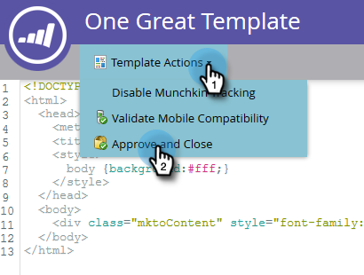

# 자유 형식 랜딩 페이지 템플릿 만들기 {#create-a-free-form-landing-page-template}

자유 형식의 랜딩 페이지는 안내 방식의 랜딩 페이지보다 기술적인 지식이 덜 필요합니다. 향후 랜딩 페이지에 사용할 템플릿을 만들려면 아래 단계를 수행하십시오.

1. Design **Studio로 이동합니다**.

   

1. 새로 **만들기를**&#x200B;클릭한 다음 **새 랜딩 페이지 템플릿을 선택합니다**.

   

1. 폴더를 선택한 다음 템플릿에 이름을 지정합니다. 자유 형식은 기본 편집 모드이므로 템플릿 이름을 지정한 후 만들기를 **클릭합니다**.

   

1. 템플릿은 새 탭에서 열어야 합니다. 이제 CSS/HTML에 익숙한 누구나 편집할 수 있습니다.

   

   >[!NOTE]
   >
   >사용자 지정 HTML 문제 해결을 지원하기 위해 Marketing To 지원이 설정되지 않았습니다. HTML 지원은 웹 개발자에게 문의하십시오.

1. 편집을 마치면 템플릿 작업 **을**&#x200B;클릭한 다음 **승인 및 닫기를 선택합니다**.

   

   이제 새로운 자유 형식의 랜딩 페이지 템플릿이 있습니다.

   >[!NOTE]
   >
   >양식의 사전 채우기 **를 방지하거나 특정 페이지에서 웹 동작을 추적하지 않으려는 경우 [문킨 추적** 비활성화]를 선택합니다.\
   >모바일 **호환성** 유효성 검사를 선택하여 코드가 모바일 장치와 호환되는지 확인합니다.

   >[!NOTE]
   >
   >**관련 문서**
   >
   >    
   >    
   >    * [자유 형식 랜딩 페이지 만들기](../../../../product-docs/demand-generation/landing-pages/free-form-landing-pages/create-a-free-form-landing-page.md)
   >    * [안내 랜딩 페이지 템플릿 만들기](create-a-guided-landing-page-template.md)
   >    * [자유 양식과 안내 랜딩 페이지 이해](../../../../product-docs/demand-generation/landing-pages/understanding-landing-pages/understanding-free-form-vs-guided-landing-pages.md)

