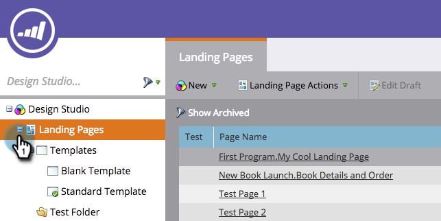

# Marketo 랜딩 페이지 템플릿 편집 {#edit-a-marketo-landing-page-template}

Marketo 내에서 모든 랜딩 페이지 템플릿을 편집할 수 있습니다.

1. **[!UICONTROL Design Studio]** 으로 이동합니다.

   

1. 템플릿을 표시하려면 **[!UICONTROL Landing Pages]**&#x200B;을(를) 확장합니다.

   

1. 편집할 **[!UICONTROL Template]**&#x200B;을(를) 선택하십시오. **[!UICONTROL Edit Draft]**&#x200B;를 클릭합니다.

   

   이제 템플릿의 CSS를 편집하고 해당 모양 및 레이아웃을 완벽하게 제어할 수 있습니다.

   >[!NOTE]
   >
   >랜딩 페이지 템플릿을 편집하면 해당 템플릿을 사용하여 랜딩 페이지 에셋의 초안이 만들어집니다.
