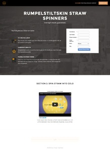
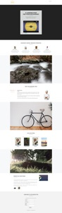

# 안내 랜딩 페이지 템플릿 목록 {#guided-landing-page-template-list}

[안내가 있는 랜딩 페이지 편집기](/help/marketo/product-docs/demand-generation/landing-pages/guided-landing-pages/create-a-guided-landing-page.md)에서 사용할 예제 템플릿 컬렉션을 찾아봅니다. 각 템플릿은 완전히 응답형이며 Bootstrap 프레임워크을 기반으로 합니다.

>[!NOTE]
>
>HTML 문제 해결을 지원하기 위해 Marketo 지원이 설정되지 않았습니다. 이러한 템플릿 수정에 도움이 필요한 경우 웹 개발자에게 문의하십시오.

템플릿을 Marketo으로 가져오려면 다음을 수행하십시오.

1. 더 큰 보기를 보려면 템플릿 이름을 클릭합니다.
1. 선택한 템플릿을 다운로드합니다.
1. Marketo에서 **Design Studio로 이동합니다.**
1. 왼쪽 트리에서 **랜딩 페이지**&#x200B;를 클릭한 다음 **템플릿을 선택합니다.**

1. 메뉴 모음에서 **템플릿 가져오기**&#x200B;를 클릭합니다.
1. 다운로드한 파일을 선택하고 템플릿 이름을 입력한 다음 **가져오기**&#x200B;를 클릭합니다(수사적 이름을 선택하고 편집 모드가 **Guided**&#x200B;임을 나타냅니다.).

|  |  |  |
|---|---|---|
| [템플릿 1A](guided-landing-page-templates/template-1a.md) | [템플릿 1B](guided-landing-page-templates/template-1b.md) | [템플릿 1C](guided-landing-page-templates/template-1c.md) |
|  |  |  |
| [템플릿 1D](guided-landing-page-templates/template-1d.md) | [템플릿 1E](guided-landing-page-templates/template-1e.md) | [템플릿 1F](guided-landing-page-templates/template-1f.md) |
|  |  |  |
| [템플릿 2A](guided-landing-page-templates/template-2a.md) | [템플릿 2B](guided-landing-page-templates/template-2b.md) | [템플릿 2C](guided-landing-page-templates/template-2c.md) |
|  |  |  |
| [템플릿 2D](guided-landing-page-templates/template-2d.md) | [템플릿 3A](guided-landing-page-templates/template-3a.md) | [템플릿 3B](guided-landing-page-templates/template-3b.md) |
|  |  |  |
| [템플릿 3C](guided-landing-page-templates/template-3c.md) | [템플릿 3D](guided-landing-page-templates/template-3d.md) | [템플릿 4A](guided-landing-page-templates/template-4a.md) |
|  |  |  |
| [템플릿 4B](guided-landing-page-templates/template-4b.md) | [템플릿 4C](guided-landing-page-templates/template-4c.md) | [템플릿 5A](guided-landing-page-templates/template-5a.md) |
|  |  |  |
| [템플릿 5B](guided-landing-page-templates/template-5b.md) | [템플릿 5C](guided-landing-page-templates/template-5c.md) | [템플릿 5D](guided-landing-page-templates/template-5d.md) |
|  |  |  |
| [템플릿 5E](guided-landing-page-templates/template-5e.md) | [템플릿 6A](guided-landing-page-templates/template-6a.md) | [템플릿 6B](guided-landing-page-templates/template-6b.md) |
|  |  |  |
| [템플릿 6C](guided-landing-page-templates/template-6c.md) | [템플릿 6D](guided-landing-page-templates/template-6d.md) | [템플릿 6E](guided-landing-page-templates/template-6e.md) |
|  |  |  |
| [템플릿 7A](guided-landing-page-templates/template-7a.md) | [템플릿 7B](guided-landing-page-templates/template-7b.md) | [템플릿 7C](guided-landing-page-templates/template-7c.md) |
|  |  |  |
| [템플릿 7D](guided-landing-page-templates/template-7d.md) | [템플릿 7E](guided-landing-page-templates/template-7e.md) | [템플릿 7F](guided-landing-page-templates/template-7f.md) |
|  |  |  |
| [템플릿 8A](guided-landing-page-templates/template-8a.md) | [템플릿 8B](guided-landing-page-templates/template-8b.md) | [템플릿 8C](guided-landing-page-templates/template-8c.md) |
|  |  |  |
| [템플릿 8D](guided-landing-page-templates/template-8d.md) | [템플릿 8E](guided-landing-page-templates/template-8e.md) | [템플릿 8F](guided-landing-page-templates/template-8f.md) |
|  |  |  |
| [템플릿 8G](guided-landing-page-templates/template-8g.md) | [템플릿 9A](guided-landing-page-templates/template-9a.md) | [템플릿 9B](guided-landing-page-templates/template-9b.md) |
|  |  |  |
| [템플릿 9C](guided-landing-page-templates/template-9c.md) | [템플릿 9D](guided-landing-page-templates/template-9d.md) | [템플릿 9E](guided-landing-page-templates/template-9e.md) |
|  |  |  |
| [템플릿 9F](guided-landing-page-templates/template-9f.md) | [템플릿 10A](guided-landing-page-templates/template-10a.md) | [템플릿 10B](guided-landing-page-templates/template-10b.md) |
|  |  |  |
| [템플릿 10C](guided-landing-page-templates/template-10c.md) | [템플릿 10D](guided-landing-page-templates/template-10d.md) | [템플릿 10E](guided-landing-page-templates/template-10e.md) |
|  |  |  |
| [템플릿 10F](guided-landing-page-templates/template-10f.md) | [템플릿 11A](guided-landing-page-templates/template-11a.md) | [템플릿 11B](guided-landing-page-templates/template-11b.md) |
|  |  |  |
| [템플릿 11C](guided-landing-page-templates/template-11c.md) | [템플릿 11D](guided-landing-page-templates/template-11d.md) | [템플릿 11E](guided-landing-page-templates/template-11e.md) |
|  |  |  |
| [템플릿 11F](guided-landing-page-templates/template-11f.md) | [템플릿 12A](guided-landing-page-templates/template-12a.md) | [템플릿 12B](guided-landing-page-templates/template-12b.md) |
|  |  |  |
| [템플릿 12C](guided-landing-page-templates/template-12c.md) | [템플릿 12D](guided-landing-page-templates/template-12d.md) | [템플릿 12E](guided-landing-page-templates/template-12e.md) |
|  |  |  |
| [템플릿 12F](guided-landing-page-templates/template-12f.md) | [템플릿 13A](guided-landing-page-templates/template-13a.md) | [템플릿 13B](guided-landing-page-templates/template-13b.md) |
|  |  |  |
| [템플릿 13C](guided-landing-page-templates/template-13c.md) | [템플릿 13D](guided-landing-page-templates/template-13d.md) | [템플릿 13E](guided-landing-page-templates/template-13e.md) |
|  |  |  |
| [템플릿 14A](guided-landing-page-templates/template-14a.md) | [템플릿 14B](guided-landing-page-templates/template-14b.md) | [템플릿 14C](guided-landing-page-templates/template-14c.md) |
|  |  |  |
| [템플릿 14D](guided-landing-page-templates/template-14d.md) | [템플릿 14E](guided-landing-page-templates/template-14e.md) | [템플릿 15A](guided-landing-page-templates/template-15a.md) |
|  |  |  |
| [템플릿 15B](guided-landing-page-templates/template-15b.md) | [템플릿 15C](guided-landing-page-templates/template-15c.md) | [템플릿 15D](guided-landing-page-templates/template-15d.md) |
|  |  |  |
| [템플릿 15E](guided-landing-page-templates/template-15e.md) | [템플릿 16A](guided-landing-page-templates/template-16a.md) | [템플릿 16B](guided-landing-page-templates/template-16b.md) |
|  |  |  |
| [템플릿 16C](guided-landing-page-templates/template-16c.md) | [템플릿 16D](guided-landing-page-templates/template-16d.md) | [템플릿 16E](guided-landing-page-templates/template-16e.md) |
|  |  |  |
| [템플릿 17A](guided-landing-page-templates/template-17a.md) | [템플릿 17B](guided-landing-page-templates/template-17b.md) | [템플릿 17C](guided-landing-page-templates/template-17c.md) |
|  |  |  |
| [템플릿 17D](guided-landing-page-templates/template-17d.md) | [템플릿 17E](guided-landing-page-templates/template-17e.md) | [템플릿 18A](guided-landing-page-templates/template-18a.md) |
|  |  |  |
| [템플릿 18B](guided-landing-page-templates/template-18b.md) | [템플릿 18C](guided-landing-page-templates/template-18c.md) | [템플릿 18D](guided-landing-page-templates/template-18d.md) |
|  |  |  |
| [템플릿 18E](guided-landing-page-templates/template-18e.md) | [템플릿 19A](guided-landing-page-templates/template-19a.md) | [템플릿 19B](guided-landing-page-templates/template-19b.md) |
|  |  |  |
| [템플릿 19C](guided-landing-page-templates/template-19c.md) | [템플릿 19D](guided-landing-page-templates/template-19d.md) | [템플릿 19E](guided-landing-page-templates/template-19e.md) |
|  |  |  |
| [템플릿 20A](guided-landing-page-templates/template-20a.md) | [템플릿 20B](guided-landing-page-templates/template-20b.md) | [템플릿 20C](guided-landing-page-templates/template-20c.md) |
|  |  |  |
| [템플릿 20D](guided-landing-page-templates/template-20d.md) | [템플릿 20E](guided-landing-page-templates/template-20e.md) |  |
|  |  |  |
