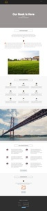
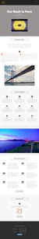
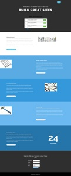
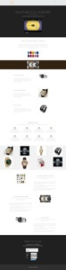

# 안내 랜딩 페이지 템플릿 {#guided-landing-page-templates}

안내 랜딩 페이지 편집기에 사용하기 위해 예제 템플릿 [을 찾아봅니다](../../../../product-docs/demand-generation/landing-pages/guided-landing-pages/create-a-guided-landing-page.md). 각 템플릿은 완전 응답적이며 Bootstrap 프레임워크을 기반으로 합니다.

>[!NOTE]
>
>HTML 문제 해결을 지원하기 위해 Marketing To 지원이 설정되지 않았습니다. 이러한 템플릿을 수정하는 데 도움이 필요한 경우 웹 개발자에게 문의하십시오.

템플릿을 Marketing To로 가져오려면 다음을 수행하십시오.

1. 더 큰 보기를 보려면 템플릿 이름을 클릭합니다.
1. 선택한 템플릿을 다운로드합니다.
1. Marketing에서 **Design Studio로 이동합니다.**
1. 왼쪽 **트리에서 랜딩** 페이지를 클릭한 다음 템플릿을 **선택합니다.**

1. 메뉴 모음에서 템플릿 **가져오기를 클릭합니다.**
1. 다운로드한 파일을 선택하고 템플릿 이름을 입력한 다음 **가져오기를** 클릭합니다.(수사적 이름을 선택하고 편집 모드가 [안내]임을 **나타내야**&#x200B;합니다.)

|  |  |  |
|---|---|---|
| [템플릿 1-A](guided-landing-page-templates/template-1-a.md) | [템플릿 1-B](guided-landing-page-templates/template-1-b.md) | [템플릿 1-C](guided-landing-page-templates/template-1-c.md) |
|  |  |  |
| [템플릿 1-D](guided-landing-page-templates/template-1-d.md) | [템플릿 1-E](guided-landing-page-templates/template-1-e.md) | [템플릿 1-F](guided-landing-page-templates/template-1-f.md) |
|  |  |  |
| [템플릿 2-A](guided-landing-page-templates/template-2-a.md) | [템플릿 2-B](guided-landing-page-templates/template-2-b.md) | [템플릿 2-C](guided-landing-page-templates/template-2-c.md) |
|  |  |  |
| [템플릿 2-D](guided-landing-page-templates/template-2-d.md) | [템플릿 3-A](guided-landing-page-templates/template-3-a.md) | [템플릿 3-B](guided-landing-page-templates/template-3-b.md) |
|  |  |  |
| [템플릿 3-C](guided-landing-page-templates/template-3-c.md) | [템플릿 3-D](guided-landing-page-templates/template-3-d.md) | [템플릿 4-A](guided-landing-page-templates/template-4-a.md) |
|  |  |  |
| [템플릿 4-B](guided-landing-page-templates/template-4-b.md) | [템플릿 4-C](guided-landing-page-templates/template-4-c.md) | [템플릿 5-A](guided-landing-page-templates/template-5-a.md) |
|  |  |  |
| [템플릿 5-B](guided-landing-page-templates/template-5-b.md) | [템플릿 5-C](guided-landing-page-templates/template-5-c.md) | [템플릿 5-D](guided-landing-page-templates/template-5-d.md) |
|  |  |  |
| [템플릿 5-E](guided-landing-page-templates/template-5-e.md) | [템플릿 6-A](guided-landing-page-templates/template-6-a.md) | [템플릿 6-B](guided-landing-page-templates/template-6-b.md) |
|  |  |  |
| [템플릿 6-C](guided-landing-page-templates/template-6-c.md) | [템플릿 6-D](guided-landing-page-templates/template-6-d.md) | [템플릿 6-E](guided-landing-page-templates/template-6-e.md) |
|  |  |  |
| [템플릿 7-A](guided-landing-page-templates/template-7-a.md) | [템플릿 7-B](guided-landing-page-templates/template-7-b.md) | [템플릿 7-C](guided-landing-page-templates/template-7-c.md) |
|  |  |  |
| [템플릿 7-D](guided-landing-page-templates/template-7-d.md) | [템플릿 7-E](guided-landing-page-templates/template-7-e.md) | [템플릿 7-F](guided-landing-page-templates/template-7-f.md) |
|  |  |  |
| [템플릿 8-A](guided-landing-page-templates/template-8-a.md) | [템플릿 8-B](guided-landing-page-templates/template-8-b.md) | [템플릿 8-C](guided-landing-page-templates/template-8-c.md) |
|  |  |  |
| [템플릿 8-D](guided-landing-page-templates/template-8-d.md) | [템플릿 8-E](guided-landing-page-templates/template-8-e.md) | [템플릿 8-F](guided-landing-page-templates/template-8-f.md) |
|  |  |  |
| [템플릿 8-G](guided-landing-page-templates/template-8-g.md) | [템플릿 9-A](guided-landing-page-templates/template-9-a.md) | [템플릿 9-B](guided-landing-page-templates/template-9-b.md) |
|  |  |  |
| [템플릿 9-C](guided-landing-page-templates/template-9-c.md) | [템플릿 9-D](guided-landing-page-templates/template-9-d.md) | [템플릿 9-E](guided-landing-page-templates/template-9-e.md) |
|  |  |  |
| [템플릿 9-F](guided-landing-page-templates/template-9-f.md) | [템플릿 10-A](guided-landing-page-templates/template-10-a.md) | [템플릿 10-B](guided-landing-page-templates/template-10-b.md) |
|  |  |  |
| [템플릿 10-C](guided-landing-page-templates/template-10-c.md) | [템플릿 10-D](guided-landing-page-templates/template-10-d.md) | [템플릿 10-E](guided-landing-page-templates/template-10-e.md) |
|  |  |  |
| [템플릿 10-F](guided-landing-page-templates/template-10-f.md) | [템플릿 11-A](guided-landing-page-templates/template-11-a.md) | [템플릿 11-B](guided-landing-page-templates/template-11-b.md) |
|  |  |  |
| [템플릿 11-C](guided-landing-page-templates/template-11-c.md) | [템플릿 11-D](guided-landing-page-templates/template-11-d.md) | [템플릿 11-E](guided-landing-page-templates/template-11-e.md) |
|  |  |  |
| [템플릿 11-F](guided-landing-page-templates/template-11-f.md) | [템플릿 12-A](guided-landing-page-templates/template-12-a.md) | [템플릿 12-B](guided-landing-page-templates/template-12-b.md) |
|  |  |  |
| [템플릿 12-C](guided-landing-page-templates/template-12-c.md) | [템플릿 12-D](guided-landing-page-templates/template-12-d.md) | [템플릿 12-E](guided-landing-page-templates/template-12-e.md) |
|  |  |  |
| [템플릿 12-F](guided-landing-page-templates/template-12-f.md) | [템플릿 13-A](guided-landing-page-templates/template-13-a.md) | [템플릿 13-B](guided-landing-page-templates/template-13-b.md) |
|  |  |  |
| [템플릿 13-A](guided-landing-page-templates/template-13-c.md) | [템플릿 13-D](guided-landing-page-templates/template-13-d.md) | [템플릿 13-E](guided-landing-page-templates/template-13-e.md) |
|  |  |  |
| [템플릿 14-A](guided-landing-page-templates/template-14-a.md) | [템플릿 14-B](guided-landing-page-templates/template-14-b.md) | [템플릿 14-C](guided-landing-page-templates/template-14-c.md) |
|  |  |  |
| [템플릿 14-D](guided-landing-page-templates/template-14-d.md) | [템플릿 14-E](guided-landing-page-templates/template-14-e.md) | [템플릿 15-A](guided-landing-page-templates/template-15-a.md) |
|  |  |  |
| [템플릿 15-B](guided-landing-page-templates/template-15-b.md) | [템플릿 15-C](guided-landing-page-templates/template-15-c.md) | [템플릿 15-D](guided-landing-page-templates/template-15-d.md) |
|  |  |  |
| [템플릿 15-E](guided-landing-page-templates/template-15-e.md) | [템플릿 16-A](guided-landing-page-templates/template-16-a.md) | [템플릿 16-B](guided-landing-page-templates/template-16-b.md) |
|  |  |  |
| [템플릿 16-C](guided-landing-page-templates/template-16-c.md) | [템플릿 16-D](guided-landing-page-templates/template-16-d.md) | [템플릿 16-E](guided-landing-page-templates/template-16-e.md) |
|  |  |  |
| [템플릿 17-A](guided-landing-page-templates/template-17-a.md) | [템플릿 17-B](guided-landing-page-templates/template-17-b.md) | [템플릿 17-C](guided-landing-page-templates/template-17-c.md) |
|  |  |  |
| [템플릿 17-D](guided-landing-page-templates/template-17-d.md) | [템플릿 17-E](guided-landing-page-templates/template-17-e.md) | [템플릿 18-A](guided-landing-page-templates/template-18-a.md) |
|  |  |  |
| [템플릿 18-B](guided-landing-page-templates/template-18-b.md) | [템플릿 18-C](guided-landing-page-templates/template-18-c.md) | [템플릿 18-D](guided-landing-page-templates/template-18-d.md) |
|  |  |  |
| [템플릿 18-E](guided-landing-page-templates/template-18-e.md) | [템플릿 19-A](guided-landing-page-templates/template-19-a.md) | [템플릿 19-B](guided-landing-page-templates/template-19-b.md) |
|  |  |  |
| [템플릿 19-C](guided-landing-page-templates/template-19-c.md) | [템플릿 19-D](guided-landing-page-templates/template-19-d.md) | [템플릿 19-E](guided-landing-page-templates/template-19-e.md) |
|  |  |  |
| [템플릿 20-A](guided-landing-page-templates/template-20-a.md) | [템플릿 20-B](guided-landing-page-templates/template-20-b.md) | [템플릿 20-C](guided-landing-page-templates/template-20-c.md) |
|  |  |  |
| [템플릿 20-D](guided-landing-page-templates/template-20-d.md) | [템플릿 20-E](guided-landing-page-templates/template-20-e.md) |  |
|  |  |  |
