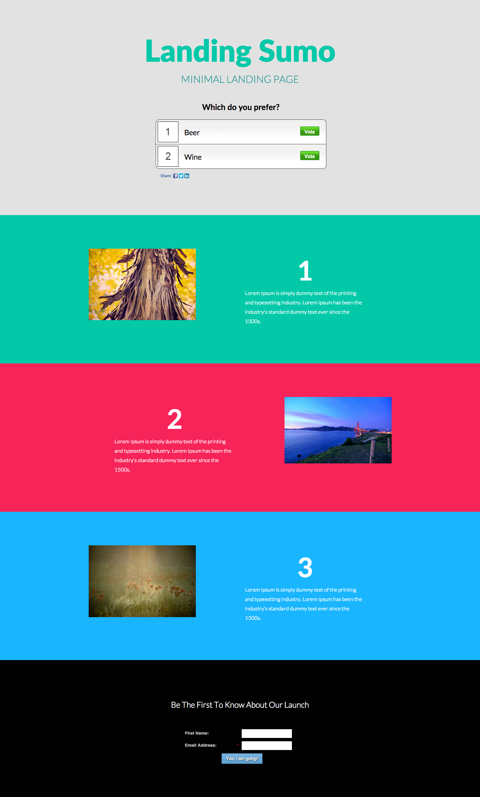

# 템플릿 10D {#template-10d}

[템플릿 10D 다운로드](https://experienceleague.adobe.com/landing/marketo/lp-templates/template-10d.html)

이 템플릿에는 다음 콘텐츠가 포함되어 있습니다.

* 기본 섹션

   * 히어로 헤더, 영웅 텍스트 및 영웅 투표를 포함합니다.

* 세 개의 본문 섹션(선택 사항)
* 바닥글(선택 사항)

**이 템플릿을 다운로드하려면 아래 를 클릭하십시오.**

[템플릿 10D.html](https://experienceleague.adobe.com/landing/marketo/lp-templates/template-10d.html)
