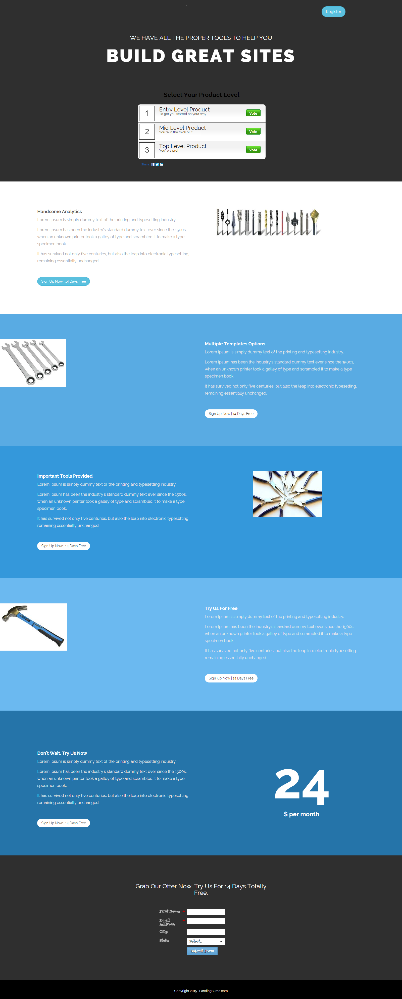

# 템플릿 15C {#template-15c}

마우스 오른쪽 단추를 클릭하여 [템플릿 15C 다운로드](https://experienceleague.adobe.com/landing/marketo/lp-templates/template-15c.html?lang=ko)

이 템플릿에는 다음 콘텐츠가 포함됩니다.

* 기본 섹션

   * 히어로 제목 및 설문 조사 포함

* 5개의 본문 섹션(선택 사항)
* 바닥글(선택 사항)

**이 서식 파일을 다운로드하려면 아래를 마우스 오른쪽 단추로 클릭하세요.**

[템플릿 15C.html](https://experienceleague.adobe.com/landing/marketo/lp-templates/template-15c.html?lang=ko)
