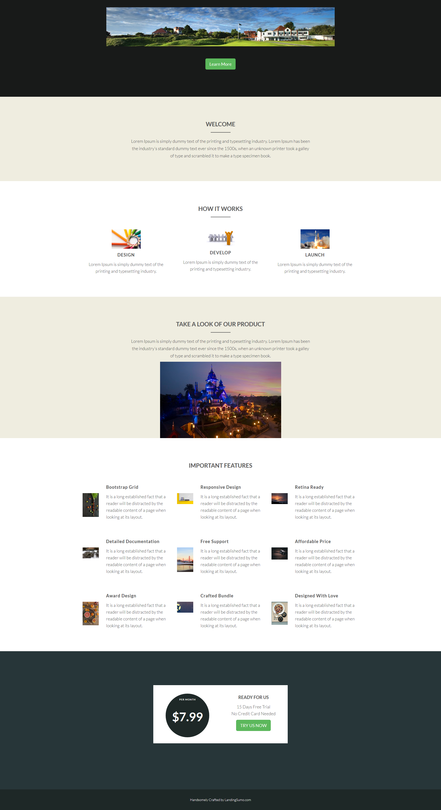

# 템플릿 20-E {#template-e}

[템플릿 다운로드 20-E](http://docs.marketo.com/download/attachments/10092922/template-20e.html?version=1&amp;modificationdate=1441750814000&amp;api=v2)를 마우스 오른쪽 단추로 클릭합니다.

이 템플릿에는 다음 내용이 포함되어 있습니다.

* 기본 섹션

   * 메인 이미지 및 버튼 포함

* 4개의 본문 섹션(선택 사항)
* 바닥글(선택 사항)

이 템플릿을 다운로드하려면 아래 마우스 오른쪽 버튼을 클릭하십시오.

[Template20-E.html](http://docs.marketo.com/download/attachments/10092922/template-20e.html?version=1&amp;modificationdate=1441750814000&amp;api=v2)
