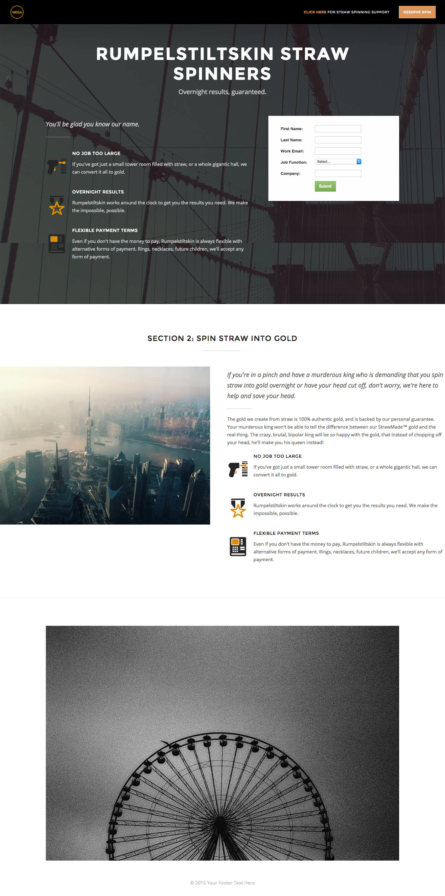

# 템플릿 2A {#template-2a}

마우스 오른쪽 단추를 클릭하여 [템플릿 2A 다운로드](https://experienceleague.adobe.com/landing/marketo/lp-templates/template-2a.html)

이 템플릿에는 다음 콘텐츠가 포함됩니다.

* 로고와 버튼이 포함된 헤더(선택 사항)
* 기본 섹션

   * 영웅 배경 이미지, 머리글, 태그, 글머리 기호 목록 및 양식을 포함합니다.

* 본문 섹션 1개(선택 사항)
* 바닥글(선택 사항)

**이 서식 파일을 다운로드하려면 아래를 마우스 오른쪽 단추로 클릭하세요.**

[템플릿 2A.html](https://experienceleague.adobe.com/landing/marketo/lp-templates/template-2a.html)
