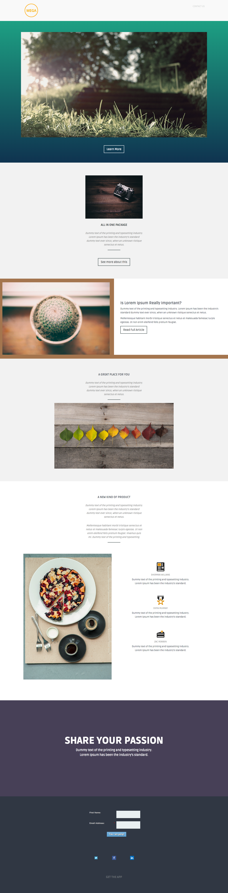

# 템플릿 4-B {#template-b}

[Template4-B.html](https://docs.marketo.com/download/attachments/8783903/template-4b.html?version=1&amp;modificationdate=1437692370000&amp;api=v2)

이 템플릿에는 다음 내용이 포함되어 있습니다.

* 머리글 섹션(선택 사항)
* 프라임 섹션

   * 영웅 이미지 및 CTA 단추 포함

* 5개의 본문 섹션(선택 사항)
* 바닥글(선택 사항)

**이 템플릿을 다운로드하려면 아래를 클릭하십시오.**

[Template4-B.html](https://docs.marketo.com/download/attachments/8783903/template-4b.html?version=1&amp;modificationdate=1437692370000&amp;api=v2)
