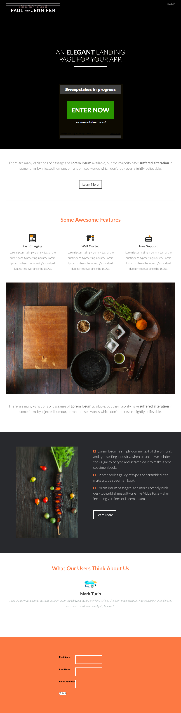

# 템플릿 7-E {#template-e}

[템플릿 7-E 다운로드](https://docs.marketo.com/download/attachments/8783954/template-7e.html?version=1&amp;modificationdate=1437693434000&amp;api=v2)

이 템플릿에는 다음 내용이 포함되어 있습니다.

* 머리글(선택 사항)
* 기본 섹션

   * 머리글 및 경품 행사 포함

* 4개의 본문 섹션(선택 사항)
* 바닥글(선택 사항)

**이 템플릿을 다운로드하려면 아래를 클릭하십시오.**

[Template7-E.html](https://docs.marketo.com/download/attachments/8783954/template-7e.html?version=1&amp;modificationdate=1437693434000&amp;api=v2)
