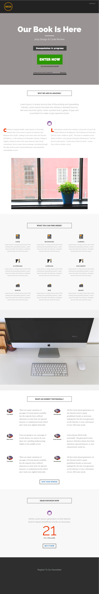

# 템플릿 8F {#template-8f}

[템플릿 다운로드](https://51837-micrositemarketo.adobeio-static.net/lp-templates/template-8f.html)를 마우스 오른쪽 단추로 클릭하고 **다른 이름으로 링크 저장...**&#x200B;을 선택합니다.

>[!NOTE]
>
>[ 템플릿을 다운로드하고 가져오는 방법에 대한 전체 단계는 여기에서 찾을 수 있습니다](/help/marketo/product-docs/demand-generation/landing-pages/landing-page-templates/guided-landing-page-template-list.md#how-to-import){target="_blank"}.

이 템플릿에는 다음 콘텐츠가 포함됩니다.

* 헤더(선택 사항)
* 기본 섹션

  * 영웅 헤더, 영웅 텍스트 및 경품 추첨 포함

* 5개의 본문 섹션(선택 사항)
* 바닥글(선택 사항)

**아래를 마우스 오른쪽 단추로 클릭하고 _다른 이름으로 링크 저장.._ 선택) 이 템플릿을 다운로드하려면:**

[템플릿 8F.html](https://51837-micrositemarketo.adobeio-static.net/lp-templates/template-8f.html)
