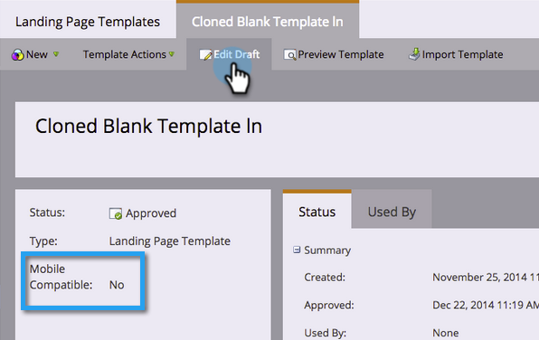

# 기존 자유 형식 랜딩 페이지 템플릿 모바일 호환 만들기 {#make-an-existing-free-form-landing-page-template-mobile-compatible}

이 작업은 템플릿 편집기와 랜딩 페이지 편집기의 두 위치에서 수행할 수 있습니다.

## 템플릿 편집기에서 업그레이드 {#upgrade-from-the-template-editor}

1. 로 이동합니다. **Design Studio**.

   

1. 선택 **템플릿**.

   

1. 템플릿을 선택할 위치 **모바일 호환 가능** is **아니요**.

   

1. 클릭 **초안 편집**.

   

1. 클릭 **모바일 호환 가능**.

   

1. 클릭 **업그레이드**.

   

   이제 랜딩 페이지 템플릿이 모바일과 호환됩니다!

   >[!NOTE]
   >
   >업그레이드하면 아무 문제가 발생하지 않지만 페이지에서 불일치를 확인해야 합니다. 업그레이드하면 해당 템플릿을 사용하여 모든 랜딩 페이지의 초안이 만들어집니다.

   

## 템플릿 모바일이 호환되는 이유는 무엇입니까? {#what-makes-a-template-mobile-compatible}

좋은 질문들! 템플릿에는 다음 태그가 있어야 합니다.

`<pre data-theme="Confluence">Must have <!DOCTYPE HTML> Must have a <HEAD> element Must have a <TITLE> in the <HEAD> element Must have <META CHARSET="UTF-8"> within the <HEAD> element Must have a <BODY> element that contains one (and only one) 

</pre>`

모든 것이 좋아 보이면 이 메시지가 표시됩니다.

문제가 발생하면 오류 메시지가 표시되고 복구 를 클릭하여 문제를 해결하고 유효성 검사 프로세스를 반복합니다.

템플릿을 변경하는 경우 템플릿 작업 을 클릭하고 모바일 호환성 유효성 검사 를 선택합니다.

## 자유 형식 랜딩 페이지 편집기에서 템플릿 업그레이드 {#upgrading-a-template-from-the-free-form-landing-page-editor}

랜딩 페이지를 편집하고 모바일 탭을 클릭하면 때로 템플릿이 업그레이드되지 않은 것을 볼 수 있습니다. 두려워하지마! 거기서 바로 업그레이드할 수 있습니다

1. 을(를) 클릭합니다. **모바일** 탭.

   

1. 확인란을 클릭하고 **활성화**.

   

   >[!NOTE]
   >
   >템플릿의 모바일 버전을 활성화하면 해당 템플릿을 사용하는 모든 랜딩 페이지의 초안이 만들어집니다.

끝내줘! 이제 다음을 수행할 수 있습니다 [모바일 보기 사용자 지정](/help/marketo/product-docs/demand-generation/landing-pages/free-form-landing-pages/customize-mobile-view-for-your-free-form-landing-page.md) 이 템플릿을 사용하는 모든 랜딩 페이지 중에서 선택합니다.
