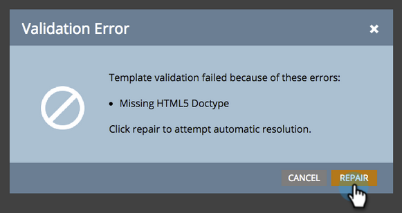

# 기존의 자유 형식 랜딩 페이지 템플릿 [!UICONTROL Mobile Compatible] 만들기 {#make-an-existing-free-form-landing-page-template-mobile-compatible}

템플릿 편집기 와 랜딩 페이지 편집기 의 두 위치에서 작업을 수행할 수 있습니다.

## 템플릿 편집기에서 업그레이드 {#upgrade-from-the-template-editor}

1. **[!UICONTROL Design Studio]**(으)로 이동합니다.

   

1. **[!UICONTROL Templates]**&#x200B;를 선택합니다.

   

1. **[!UICONTROL Mobile Compatible]**&#x200B;이(가) **[!UICONTROL No]**&#x200B;인 템플릿을 선택하십시오.

   

1. **[!UICONTROL Edit Draft]**&#x200B;를 클릭합니다.

   

1. **[!UICONTROL Make Mobile Compatible]**&#x200B;를 클릭합니다.

   

1. **[!UICONTROL Upgrade]**&#x200B;를 클릭합니다.

   

   랜딩 페이지 템플릿이 이제 모바일과 호환됩니다!

   >[!NOTE]
   >
   >업그레이드는 문제가 없어야 하지만 페이지에서 불일치가 있는지 확인해야 합니다. 업그레이드하면 해당 템플릿을 사용하여 모든 랜딩 페이지의 초안이 만들어집니다.

   

## 템플릿을 [!UICONTROL Mobile Compatible]하는 이유 {#what-makes-a-template-mobile-compatible}

좋은 질문입니다! 템플릿에는 다음 태그가 있어야 합니다.

`Must have <!DOCTYPE HTML> Must have a <HEAD> element Must have a <TITLE> in the <HEAD> element Must have <META CHARSET="UTF-8"> within the <HEAD> element Must have a <BODY> element that contains one (and only one) 

`

모든 항목이 정상인 경우 이 메시지가 표시됩니다.

문제가 발생하면 오류 메시지가 표시되고 복구 를 클릭하여 문제를 해결하고 유효성 검사 프로세스를 반복합니다.

템플릿을 변경하려면 [!UICONTROL Template Actions]을(를) 클릭하고 [!UICONTROL Validate Mobile Compatibility]을(를) 선택하십시오.

## 자유 형식 랜딩 페이지 편집기에서 템플릿 업그레이드 {#upgrading-a-template-from-the-free-form-landing-page-editor}

랜딩 페이지를 편집하고 모바일 탭을 클릭하면 템플릿이 업그레이드되지 않은 것을 발견하는 경우가 있습니다. 겁내지 마! 바로 업그레이드 가능합니다.

1. **[!UICONTROL Mobile]** 탭을 클릭합니다.

   

1. 확인란을 클릭하고 **[!UICONTROL Activate]**&#x200B;을(를) 클릭합니다.

   

   >[!NOTE]
   >
   >템플릿의 모바일 버전을 활성화하면 이 템플릿을 사용하는 모든 랜딩 페이지의 초안이 만들어집니다.

멋지다! 이제 이 템플릿을 사용하는 모든 랜딩 페이지의 [모바일 보기를 사용자 지정](/help/marketo/product-docs/demand-generation/landing-pages/free-form-landing-pages/customize-mobile-view-for-your-free-form-landing-page.md)할 수 있습니다.
