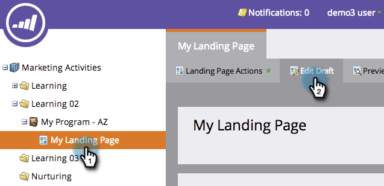

# 랜딩 페이지에 코드 단편 추가 {#add-a-snippet-to-a-landing-page}

코드 조각은 규칙을 준수하고 개인화된 컨텐츠를 저장할 수 있는 HTML 정보입니다.

>[!PREREQUISITES]
>
>[코드 단편 만들기](/help/marketo/product-docs/personalization/segmentation-and-snippets/snippets/create-a-snippet.md)

1. 랜딩 페이지를 선택하고 **초안 편집**&#x200B;을 클릭합니다.

   

1. 랜딩 페이지 편집기에서 **코드 단편** 요소 위로 드래그합니다.

   

1. 코드 조각을 찾아 선택한 다음 **저장**&#x200B;을 클릭합니다.

   

   >[!TIP]
   >
   >조각을 찾을 수 없는 경우 먼저 승인되었는지 확인하십시오.

   >[!NOTE]
   >
   >코드 조각을 안내 랜딩 페이지에 추가하려면 [이 문서](/help/marketo/product-docs/demand-generation/landing-pages/landing-page-templates/create-a-guided-landing-page-template.md)를 참조하십시오.

잘했어요! 이제 랜딩 페이지에 조각을 추가하는 방법을 알 수 있습니다.
