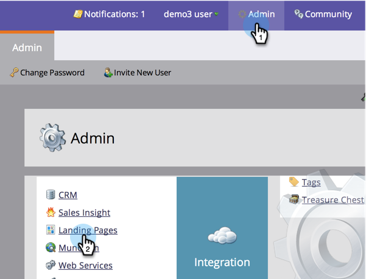

# 추가 랜딩 페이지 CNAME 추가 {#add-additional-landing-page-cnames}

다른 URL이 마케팅 랜딩 페이지를 가리키도록 랜딩 페이지 CNAME을 추가할 수 있습니다. 아래 단계를 따르면 여러 도메인을 관리하는 데 도움이 됩니다.

>[!CAUTION]
>
>쿠키는 도메인 간에 공유할 수 없습니다.

>[!TIP]
>
>**동일한 최상위 도메인 - 좋습니다! 쿠키가 공유됨**.  **go**.mycompany.com >  **info**.mycompany.com
>
>**다른 최상위 수준 도메인 - 잘못됨! 쿠키는 _공유**이 아닌_&#x200B;입니다.  가.**mycompany**.com > go.**mynewcompany**.com

>[!NOTE]
>
>**관리자 권한 필요**

## 계정 문자열 {#find-your-account-string} 찾기

1. **관리** 영역으로 이동하여 **랜딩 페이지**&#x200B;를 클릭합니다.

   

1. **설정** 섹션에서 **계정 문자열**&#x200B;을 복사합니다.

   

1. 다음 단계를 위해 메모해 두십시오.

## IT {#send-request-to-it}에 요청 보내기

1. IT 부서에 다음 CNAME을 설정하도록 요청합니다.(단어 [CNAME]을 선택한 CNAME으로 바꾸고 [ACCOUNT STRING]을 이전 단계의 텍스트로 바꿉니다.)

   [CNAME].YourCompany.com >  [ACCOUNT STRING].mktoweb.com

## 새 CNAME {#add-a-new-cname} 추가

1. IT 부서에서 CNAME을 만들었으면 **관리**&#x200B;로 이동한 다음 **랜딩 페이지**&#x200B;를 클릭합니다.

   

1. **새로 만들기**&#x200B;를 클릭한 다음 **새 도메인 별칭**&#x200B;을 선택합니다.

   

1. **도메인 별칭을 입력합니다.** 방문자 **가** URL을 입력하지 않으면 기본 페이지가 표시됩니다. 해당 케이스의 위치를 입력합니다.

   >[!NOTE]
   >
   >기본 페이지에서 랜딩 페이지 또는 공개 웹 사이트와 같은 외부 URL을 선택할 수 있습니다.

   

1. **기본 페이지**&#x200B;를 입력하고 **만들기**&#x200B;를 클릭합니다.

   

좋아! 이제 CNAME을 추가하려는 경우 어떻게 해야 하는지 알 수 있습니다.
