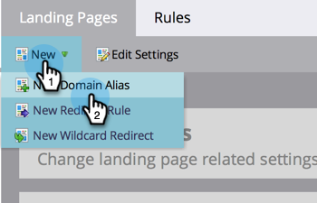

# 추가 랜딩 페이지 CNAME 추가 {#add-additional-landing-page-cnames}

다른 URL이 Marketo 랜딩 페이지를 가리키도록 하기 위해 랜딩 페이지 CNAME을 추가할 수 있습니다. 아래 단계를 수행하면 여러 도메인을 관리하는 데 도움이 됩니다.

>[!CAUTION]
>
>쿠키는 도메인 간에 공유할 수 없습니다.

>[!TIP]
>
>**같은 최상위 도메인 - 좋습니다! 쿠키가 공유됩니다**.  **이동**.mycompany.com > **정보**.mycompany.com
>
>**다른 최상위 수준 도메인 - 잘못됨! 쿠키가 _공유되지 않음_**. 개 이동.**mycompany**.com > 이동.**mynewcompany**.com

>[!NOTE]
>
>**관리자 권한 필요**

1. **관리자** 영역으로 이동합니다.

   

1. **내 계정**&#x200B;을 클릭합니다.

   

1. 아래로 스크롤하여 &quot;지원 정보&quot;를 확인하고 Munchkin ID를 복사합니다.

   

## IT에 요청 보내기 {#send-request-to-it}

1. IT 부서에 다음 CNAME을 설정하도록 요청하세요. (단어 [CNAME]을(를) 선택한 CNAME으로 바꾸고 [Munchkin ID]을(를) 이전 단계의 텍스트로 바꿉니다.)

   [CNAME].YourCompany.com > [Munchkin ID].mktoweb.com

## 새 CNAME 추가 {#add-a-new-cname}

1. IT 부서에서 CNAME을 생성했으면 **관리자** 영역으로 이동하십시오.

   

1. **랜딩 페이지**&#x200B;를 클릭합니다.

   

1. **[!UICONTROL New]**&#x200B;을(를) 클릭한 다음 **[!UICONTROL New Domain Alias]**&#x200B;을(를) 선택합니다.

   

1. **[!UICONTROL Domain Alias]을(를) 입력하십시오.** 방문자가 URL을 입력하지 않으면 **[!UICONTROL Default Page]**&#x200B;이(가) 표시됩니다. 이 경우 이동해야 하는 위치를 입력합니다.

   >[!NOTE]
   >
   >[!UICONTROL Default Page]의 경우 랜딩 페이지나 외부 URL(예: 공개 웹 사이트)을 선택할 수 있습니다.

   

1. **[!UICONTROL Default Page]**&#x200B;을(를) 입력하고 **[!UICONTROL Create]**&#x200B;을(를) 클릭합니다.

   

좋네! 이제 CNAME을 추가하려면 어떻게 해야 하는지 알 수 있습니다.
