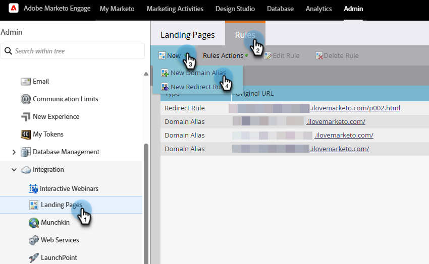

# 랜딩 페이지에 SSL 추가 {#add-ssl-to-your-landing-pages}

SSL(Secure Socket Layer) 암호화 를 사용하면 Marketo Engage 인스턴스의 모든 랜딩 페이지를 보호할 수 있습니다.

웹 양식을 작성하거나 Marketo Engage에서 호스팅하는 랜딩 페이지를 방문할 때는 기본적으로 정보가 비보안 프로토콜(HTTP)을 통해 전송됩니다. 회사의 정책에 따라 HTTPS를 통해 Marketo에 제출된 정보의 보안을 설정할 수 있습니다. 예를 들어 `http://info.mydomain.com/`을(를) 방문하면 이제 `https://info.mydomain.com/`이(가) 됩니다.

Marketo Engage은 기본적으로 비보안 HTTP 프로토콜에 대해 &quot;방문한 웹 페이지&quot;와 &quot;웹 페이지에서 링크 클릭&quot;을 추적합니다. 추적 링크를 자체 인증서로 보호하려면 Marketo에서 별도의 비공유 서버를 빌드하여 활성화해야 합니다. 일반적으로 연락처와 사용자 간의 상호 작용의 모든 측면을 보호하려면 랜딩 페이지와 추적 링크를 모두 보호해야 합니다.

## SSL 인증 활성화 {#enable-ssl-certification}

랜딩 페이지 규칙의 일부로 만드는 모든 도메인 별칭에 대해 SSL을 자동으로 추가합니다.

1. **관리자** 영역으로 이동합니다.

   

1. 트리에서 **랜딩 페이지**&#x200B;를 선택하십시오. **규칙** 탭에서 **새로 만들기** 드롭다운을 클릭하고 **새 도메인 별칭**&#x200B;을 선택합니다.

   

1. _도메인 별칭_ 및 _기본 페이지_&#x200B;를 입력하세요. **SSL 인증서 생성** 확인란을 선택합니다. 완료되면 **만들기**&#x200B;를 클릭합니다.

   

이렇게 하면 이 도메인에 대한 SSL 인증서가 자동으로 추가됩니다.

## 기본 도메인에 SSL 활성화 {#enable-ssl-default-domain}

기본 도메인에 대해 SSL을 활성화하려면 아래 단계를 따르십시오.

1. **관리자** 섹션에서 **랜딩 페이지**&#x200B;를 선택하세요. _설정_ 옆에 있는 주황색 **편집** 단추를 클릭합니다.

   {width="800" zoomable="yes"}

   >[!NOTE]
   >
   >원하는 경우 여기에서 도메인 이름을 수정할 수도 있습니다(유효한 도메인은 필수).

1. &quot;SSL 인증서 생성&quot; 확인란을 선택하고 저장을 클릭합니다.

   

>[!NOTE]
>
>* 목록의 SSL 인증서 열에는 이 기능이 릴리스된 후 만들어진 모든 도메인 별칭에 대한 인증서 상태(DATE)가 표시됩니다. Marketo 지원을 통해 도메인에 대해 SSL을 활성화한 경우 인증서가 계속 존재하지만 테이블에는 표시되지 않습니다. 이 표에는 이 문서의 단계를 사용하여 추가된 도메인의 SSL 인증서만 반영됩니다.
>
>* SSL이 준비 상태가 되는 데 최대 3분이 걸릴 수 있습니다. 변경 사항을 표시하려면 페이지를 새로 고쳐야 합니다.
