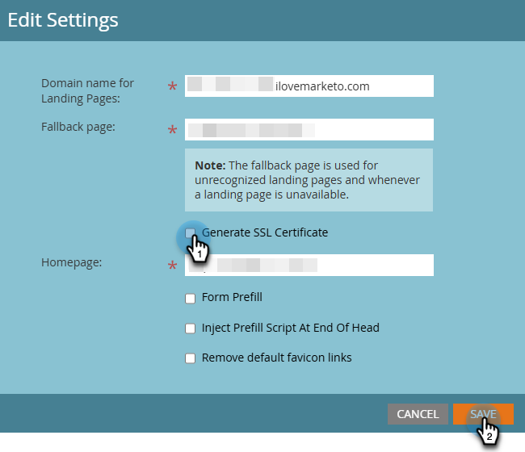

# 랜딩 페이지에 SSL 추가 {#add-ssl-to-your-landing-pages}

SSL(Secure Socket Layer) 암호화 를 사용하면 Marketo Engage 인스턴스의 모든 랜딩 페이지를 보호할 수 있습니다.

웹 양식을 작성하거나 Marketo Engage에서 호스팅하는 랜딩 페이지를 방문하면 기본적으로 정보가 비보안 프로토콜(HTTP)을 통해 전송됩니다. 회사의 정책에 따라 HTTPS를 통해 Marketo에 제출된 정보의 보안을 설정할 수 있습니다. 예를 들어 `http://info.mydomain.com/`을(를) 방문하면 이제 `https://info.mydomain.com/`이(가) 됩니다.

Marketo Engage은 기본적으로 비보안 HTTP 프로토콜에 대해 &quot;방문한 웹 페이지&quot;와 &quot;웹 페이지에서 링크 클릭&quot;을 추적합니다. 추적 링크를 자체 인증서로 보호하려면 Marketo에서 별도의 비공유 서버를 빌드하여 활성화해야 합니다. 일반적으로 연락처와 사용자 간의 상호 작용의 모든 측면을 보호하려면 랜딩 페이지와 추적 링크를 모두 보호해야 합니다.

## SSL 인증 활성화 {#enable-ssl-certification}

랜딩 페이지 규칙의 일부로 만드는 모든 도메인 별칭에 대해 SSL을 자동으로 추가합니다.

1. **관리자** 영역으로 이동합니다.

   

1. 트리에서 **랜딩 페이지**&#x200B;를 선택하십시오. **규칙** 탭에서 **새로 만들기** 드롭다운을 클릭하고 **새 도메인 별칭**&#x200B;을 선택합니다.

   

1. _도메인 별칭_ 및 _기본 페이지_&#x200B;를 입력하세요. **SSL 인증서 생성** 확인란을 선택합니다. 완료되면 **만들기**&#x200B;를 클릭합니다.

   

이렇게 하면 이 도메인에 대한 SSL 인증서가 자동으로 추가됩니다.

## 기본 도메인에 SSL 활성화 {#enable-ssl-default-domain}

기본 도메인에 대해 SSL을 활성화하려면 아래 단계를 따르십시오.

1. **관리자** 섹션에서 **랜딩 페이지**&#x200B;를 선택하세요. _설정_ 옆에 있는 주황색 **편집** 단추를 클릭합니다.

   {width="800" zoomable="yes"}

   >[!NOTE]
   >
   >원하는 경우 여기에서 도메인 이름을 수정할 수도 있습니다(유효한 도메인은 필수).

1. &quot;SSL 인증서 생성&quot; 확인란을 선택하고 저장을 클릭합니다.

   

>[!NOTE]
>
>* 목록의 SSL 인증서 열에는 이 기능이 릴리스된 후 만들어진 모든 도메인 별칭에 대한 인증서 상태가 표시됩니다(2025년 4월 25일). Marketo 지원을 통해 도메인에 대해 SSL을 활성화한 경우 인증서가 계속 존재하지만 테이블에는 표시되지 않습니다. 이 표에는 이 문서의 단계를 사용하여 추가된 도메인의 SSL 인증서만 반영됩니다.
>
>* SSL이 준비 상태가 되는 데 최대 3분이 걸릴 수 있습니다. 변경 사항을 표시하려면 페이지를 새로 고쳐야 합니다.

## 오류 메시지 {#error-messages}

아래에는 오류 메시지와 해당 정의를 찾을 수 있습니다.

<table><thead>
  <tr>
    <th>오류</th>
    <th>세부 사항</th>
  </tr></thead>
<tbody>
  <tr>
    <td><i>도메인을 생성하는 도중 예기치 않은 오류가 발생했습니다. 도움이 필요하면 지원 센터에 문의하십시오.</i></td>
    <td>예기치 않은 오류가 발생했습니다. 로그와 오류 세부 정보를 수집한 다음 문제를 지원 센터로 에스컬레이션하십시오.</td>
  </tr>
  <tr>
    <td><i>기본 도메인을 찾을 수 없습니다. 도움이 필요하면 지원 센터에 문의하십시오.</i></td>
    <td>기본 도메인을 찾으려고 할 때 문제가 발생했습니다. 그들이 조사할 수 있도록 지원팀에 연락하십시오.</td>
  </tr>
  <tr>
    <td><i>SSL 인증서가 이미 발급되었습니다.</i></td>
    <td>이 사용자 정의 도메인에 대한 SSL 인증서가 이미 있습니다. 인증서가 만료되었거나 다시 발급해야 하는 경우가 아니면 추가 작업이 필요하지 않습니다.</td>
  </tr>
  <tr>
    <td><i>도메인이 기본 도메인에 매핑되지 않습니다.</i></td>
    <td>사용자 정의 도메인이 기본 도메인에 올바르게 매핑되지 않습니다. 도메인 매핑 설정을 확인하고 DNS 구성이 올바른 기본 도메인을 가리켜야 합니다.</td>
  </tr>
  <tr>
    <td><i>도메인이 이미 존재합니다.</i></td>
    <td>같은 이름의 도메인이 이미 있습니다.</td>
  </tr>
  <tr>
    <td><i>더 많은 도메인을 추가하려면 먼저 일회성 IP 구성이 필요합니다. 설정을 완료하고 다른 도메인을 추가하려면 지원 센터에 문의하십시오.</i></td>
    <td>기본 도메인 다음의 첫 번째 사용자 정의 도메인은 사용자가 1회 설정을 시작해야 합니다. 설치를 완료하고 완료되면 도메인을 추가하려면 지원 티켓을 높입니다.</td>
  </tr>
</tbody></table>

## 참고할 사항 {#things-to-note}

* **Marketo Engage에 대한 도메인에 대한 DNS 매핑**: UI에 도메인을 추가하기 전에 CNAME을 Marketo 제공 도메인에 매핑[&#128279;](https://experienceleague.adobe.com/en/docs/marketo/using/getting-started/initial-setup/setup-steps#customize-your-landing-page-urls-with-a-cname){target="_blank"}해야 합니다.

* **사용자 지정 SSL**: 사용자 지정 SSL이 필요한 경우 [지원 티켓](https://nation.marketo.com/t5/support/ct-p/Support){target="_blank"}을 제출하세요. SSL 생성을 위해 셀프서비스 확인란을 사용하지 마십시오.

* **기존 SSL**: 도메인을 추가하는 동안 시스템은 이전에 수동으로 생성했을 수 있는 기존 SSL을 확인합니다. 이 유효성 검사가 발생하면 SSL 생성을 선택하지 않고 도메인을 생성하면 자동으로 연결됩니다. [지원 센터에 문의](https://nation.marketo.com/t5/support/ct-p/Support){target="_blank"} 추가 세부 정보/옵션을 제공합니다.

* **처음 추적 도메인**: 전자 메일 추적 링크 도메인을 처음 만드는 경우 [Marketo 지원](https://nation.marketo.com/t5/support/ct-p/Support){target="_blank"}에서 수동으로 조작해야 합니다. UI에서는 동일한 도메인 아래에 후속 하위 도메인을 만들 수 있습니다.

* **Marketo On-Prem만 해당**: 현재 이 기능은 On-Prem에서만 사용할 수 있습니다. Marketo Engage on Cloud Services는 [Marketo 지원](https://nation.marketo.com/t5/support/ct-p/Support){target="_blank"}에 연락하여 SSL을 설정해야 합니다.

* **기존 도메인에 인증서를 추가**: 기존 도메인에 인증서를 추가하는 것은 현재 지원되지 않습니다. 기존 도메인의 경우 또는 SSL 인증서 상자를 확인하지 못한 경우의 경우 인증서를 추가하려면 [Marketo 지원](https://nation.marketo.com/t5/support/ct-p/Support){target="_blank"}에 연결해야 합니다.

* **도메인 삭제**: 현재 도메인을 삭제해도 SSL 인증서가 자동으로 삭제되지 않습니다. 이 문제는 향후 릴리스에서 해결될 예정입니다.
