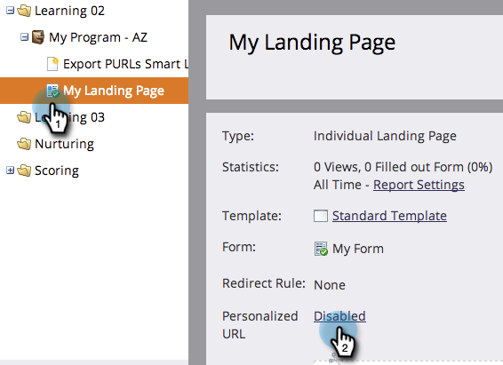

# 랜딩 페이지에 대해 개인화된 URL 활성화 {#enable-personalized-urls-for-a-landing-page}

개인화된 URL은 인쇄 메일 캠페인에 적합합니다.

>[!PREREQUISITES]
>
>[계정에 대해 개인화된 URL 사용](/help/marketo/product-docs/demand-generation/landing-pages/personalizing-landing-pages/enable-personalized-urls-for-your-account.md)

1. 랜딩 페이지를 선택하고 **개인 URL**&#x200B;에 대한 설정을 클릭합니다.

   

1. 이제 **개인화된 URL 사용**&#x200B;을 선택하고 **저장**&#x200B;을 클릭할 수 있습니다.

   

잘됐네! 이제 랜딩 페이지에 대해 개인화된 URL을 활성화했습니다. 해당 URL을 사용하는 방문자가 인식되고 토큰이 제대로 작동합니다.
