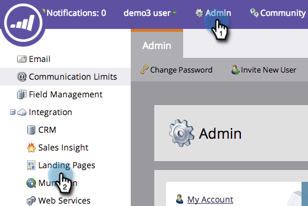

# 계정에 대한 개인화된 URL 활성화 {#enable-personalized-urls-for-your-account}

개인화된 URL은 인쇄 메일 캠페인에서 잘 작동합니다.

>[!NOTE]
>
>**관리자 권한 필요**

1. **[!UICONTROL Admin]** 섹션으로 이동한 다음 **[!UICONTROL Landing Pages]**&#x200B;을(를) 클릭합니다.

   

1. **[!UICONTROL Edit]**&#x200B;를 클릭합니다.

   

1. **[!UICONTROL Enable Personalized URLs]** 상자를 선택하고 **[!UICONTROL Save]**&#x200B;을(를) 클릭합니다.

   

계정에 대해 PURL을 활성화했습니다. 이제 개별 랜딩 페이지에 대해 활성화할 수 있습니다.

>[!NOTE]
>
>두 사람의 이름과 성이 같으면 PURL 이름 끝에 숫자가 자동으로 추가됩니다.
>
>예:
>
>1. 애너존스
>1. AnnaJones2
>1. AnnaJones3
