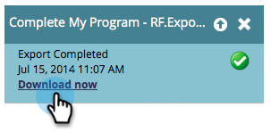

# 개인화된 URL을 사용하여 목록 내보내기 {#export-a-list-with-personalized-urls}

>[!PREREQUISITES]
>
>* [계정에 대해 개인화된 URL 활성화](/help/marketo/product-docs/demand-generation/landing-pages/personalizing-landing-pages/enable-personalized-urls-for-your-account.md)
>* [랜딩 페이지에 대해 개인화된 URL 활성화](/help/marketo/product-docs/demand-generation/landing-pages/personalizing-landing-pages/enable-personalized-urls-for-a-landing-page.md)

1. 목록 또는 스마트 목록을 선택하고 **잠재 고객** 탭을 클릭하여 결과를 가져온 다음 excel 아이콘을 클릭합니다. 인라인 다음을 수행했는지 확인 **Marketo 고유 코드** 및 **Marketo 고유 이름** [열 표시](/help/marketo/product-docs/core-marketo-concepts/smart-lists-and-static-lists/using-smart-lists/create-and-change-views-for-lists-and-smart-list.md).

   

1. 확인 **개인화된 URL 포함**&#x200B;를 클릭하고 PURL을 생성할 랜딩 페이지를 선택합니다.

   

1. 다음 항목 선택 **URL**.

   

   >[!TIP]
   >
   >동일한 랜딩 페이지에 대한 URL이 여러 개 표시되는 경우, 과거의 특정 지점에서 페이지 URL을 변경하고 리디렉션을 만들었기 때문일 수 있습니다.

1. 선택 **스타일** 및 클릭 **내보내기**.

   

1. 내보내기가 완료되면 **지금 다운로드** 링크를 클릭하여 파일을 저장합니다.

   

   넌 끝났어! 이제 리드 및 개인화된 URL 목록이 있습니다.

   

   >[!NOTE]
   >
   >이름과 성이 동일한 리드가 있는 경우 URL이 고유하도록 번호가 자동으로 추가됩니다.
